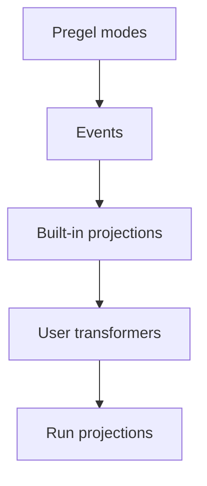

对于大多数 LangGraph 应用代码，**Event Streaming（事件流）**是推荐的进程内流式模型。它会返回一个 Run Stream 对象，可以同时通过多种方式消费同一条底层事件流。

## 快速入门

:::python
```py
stream = graph.stream_events({
    "messages": [{"role": "user", "content": "What is 42 * 17?"}],
}, version="v3")

for message in stream.messages:
    for token in message.text:
        print(token, end="", flush=True)

final_state = stream.output
```
:::

:::js
```ts
const stream = await graph.streamEvents(
  { messages: [{ role: "user", content: "What is 42 * 17?" }] },
  { version: "v3" }
);

for await (const message of stream.messages) {
  for await (const token of message.text) {
    process.stdout.write(token);
  }
}

const finalState = await stream.output;
```
:::

如果要对部署在 Agent Server 后面的图进行 Streaming，请参阅 [LangSmith Streaming API](/langsmith/streaming)。

## 各层之间如何协作

Streaming Stack 主要包含两层：

1. **Streaming** 从 Pregel Engine 发出原始图执行事件。
2. **Event Streaming** 对这些事件进行标准化，让它们依次经过 Stream Transformer，并暴露为类型化 Projection。

<div className="my-6 rounded-xl border bg-gray-50 p-4 dark:bg-gray-900">
  <div className="mx-auto max-w-2xl space-y-2 text-sm">
    <div className="rounded-lg border border-slate-300 bg-white p-3 text-center dark:border-slate-700 dark:bg-slate-950">
      <div className="font-semibold text-slate-900 dark:text-slate-100">Pregel Engine</div>
      <div className="mt-1 text-xs text-slate-600 dark:text-slate-300">执行图的各个 Step</div>
    </div>
    <div className="text-center text-xs font-medium uppercase tracking-wide text-slate-500 dark:text-slate-400">发出</div>
    <div className="rounded-lg border border-orange-300 bg-orange-50 p-3 text-center dark:border-orange-800 dark:bg-orange-950">
      <div className="font-semibold text-orange-900 dark:text-orange-100">原始 Pregel 事件</div>
      <div className="mt-1 text-xs text-orange-700 dark:text-orange-300"><code>updates</code>, <code>values</code>, <code>messages</code>, <code>custom</code>, <code>checkpoints</code>, <code>tasks</code>, <code>debug</code></div>
    </div>
    <div className="text-center text-xs font-medium uppercase tracking-wide text-slate-500 dark:text-slate-400">发送到</div>
    <div className="rounded-lg border border-blue-300 bg-blue-50 p-3 text-center dark:border-blue-800 dark:bg-blue-950">
      <div className="font-semibold text-blue-900 dark:text-blue-100">Event Router</div>
      <div className="mt-1 text-xs text-blue-700 dark:text-blue-300">把每个事件路由到 Transformer Pipeline</div>
    </div>
    <div className="text-center text-xs font-medium uppercase tracking-wide text-slate-500 dark:text-slate-400">依次经过</div>
    <div className="rounded-lg border border-green-300 bg-green-50 p-3 dark:border-green-800 dark:bg-green-950">
      <div className="font-semibold text-green-900 dark:text-green-100">Stream Transformer</div>
      <div className="mt-2 grid gap-2 text-xs text-green-800 dark:text-green-200 sm:grid-cols-4">
        <div className="rounded border border-green-200 bg-white px-2 py-1 dark:border-green-800 dark:bg-green-950">ValuesTransformer</div>
        <div className="rounded border border-green-200 bg-white px-2 py-1 dark:border-green-800 dark:bg-green-950">MessagesTransformer</div>
        <div className="px-2 py-1 text-center text-green-600 dark:text-green-300">...</div>
        <div className="rounded border border-green-200 bg-white px-2 py-1 dark:border-green-800 dark:bg-green-950">自定义 Transformer</div>
      </div>
    </div>
    <div className="text-center text-xs font-medium uppercase tracking-wide text-slate-500 dark:text-slate-400">生成</div>
    <div className="rounded-lg border border-purple-300 bg-purple-50 p-3 text-center dark:border-purple-800 dark:bg-purple-950">
      <div className="font-semibold text-purple-900 dark:text-purple-100">Event Stream</div>
      <div className="mt-1 text-xs text-purple-700 dark:text-purple-300">供应用代码消费的 Projection Event</div>
    </div>
  </div>
</div>

Event Router 是这两层之间的桥梁。它接收标准化后的 Pregel Event，并让每个事件依次经过已注册的 Stream Transformer。内置 Transformer 会生成标准 Projection，例如 `stream.messages`、`stream.values`、`stream.subgraphs` 和 `stream.output`；自定义 Transformer 则可以在 `stream.extensions` 下增加应用自己的 Projection。

## Event Streaming 提供什么

Run Stream 基于同一条底层事件流暴露多个类型化 Projection：

| Projection | 用途 |
| ---------- | --- |
| `stream` | 遍历所有 Protocol Event。 |
| `stream.messages` | 流式读取 Chat Model 消息和 Token Delta。 |
| `stream.values` | 遍历 State Snapshot，并等待最终 Value。 |
| `stream.output` | 等待最终输出。 |
| `stream.subgraphs` | 发现并观察嵌套图的执行。 |
| `stream.interrupts` | 检查人在回路 Interrupt Payload。 |
| `stream.interrupted` | 判断 Run 是否因等待人工输入而暂停。 |
| `stream.extensions` | 消费自定义 Stream Transformer 生成的 Projection。 |

多个消费者可以并发读取这些 Projection。读取 `stream.messages` 不会消费掉 `stream.values`、`stream.subgraphs` 或 `stream.output` 所需的事件。

Event Streaming 位于普通 [Streaming](/oss/langgraph/streaming) 之上一层。后者通过 `stream_mode` 暴露原始图执行事件，例如 `updates`、`values`、`messages`、`custom`、`checkpoints`、`tasks` 和 `debug`。需要低层访问这些 Mode 时使用 Streaming；当应用代码更适合使用类型化 Projection 时，则使用 Event Streaming。

## 流式读取消息

使用 `stream.messages` 获取 Chat Model 输出：

:::python
```py
stream = graph.stream_events(input, version="v3")

for message in stream.messages:
    text = str(message.text)
    usage = message.output.usage_metadata

    print(text)
    print(usage)
```
:::

:::js
```ts
const stream = await graph.streamEvents(input, { version: "v3" });

for await (const message of stream.messages) {
  const text = await message.text;
  const usage = await message.usage;

  console.log(text);
  console.log(usage);
}
```
:::

:::python
在同步代码中，`message.text` 本身可以遍历。逐 Token 输出时直接遍历它；如果要获得完整文本，可以调用 `str(message.text)`。

`message.reasoning` 会暴露 Reasoning Delta，`message.tool_calls` 会暴露 Tool Call 参数的 Chunk。如果你需要严格按照到达顺序同时获得文本、Reasoning 和 Tool Call Chunk，应遍历 Message Stream 的原始事件，而不是分别消费这些 Projection。
:::

:::js
`message.text` 同时是 Async Iterable 和类似 Promise 的值。逐 Token 输出时遍历它；如果要获得完整文本，则直接 `await`。
:::

## 流式观察子图

使用 `stream.subgraphs` 可以直接观察嵌套图的执行，而不需要自己解析 Namespace 字符串：

:::python
```py
stream = graph.stream_events(input, version="v3")

for subgraph in stream.subgraphs:
    print(subgraph.graph_name, subgraph.path)

    for message in subgraph.messages:
        print(message.text)
```
:::

:::js
```ts
const stream = await graph.streamEvents(input, { version: "v3" });

for await (const subgraph of stream.subgraphs) {
  console.log(subgraph.name, subgraph.path);

  for await (const message of subgraph.messages) {
    console.log(await message.text);
  }
}
```
:::

`subgraph.graph_name` 是编译后 Graph 或 Agent 的 `name`。如果一个命名 Agent 是从 Tool 中分发执行的，例如通过 Deep Agents 的 `task` Tool 调用了 `create_agent(name=...)`，这里就会以该名称出现；打开这个 Scope 的 `lifecycle` Event 中还会包含一个 `cause`，指向发起分发的 Tool Call。更多信息请参阅 [Lifecycle](#lifecycle)。

如果使用特定产品的 Stream，请参阅 [Deep Agents Streaming](/oss/deepagents/event-streaming)了解 Subagent Stream，并参阅 [LangChain Agent Streaming](/oss/langchain/streaming)了解 Tool Call 和 Middleware Event。

## 流式读取 State

使用 `stream.values` 可以在每个 Step 之后流式读取完整 State Snapshot：

:::python
```py
stream = graph.stream_events(input, version="v3")

for snapshot in stream.values:
    print(snapshot)

final_state = stream.output
```
:::

:::js
```ts
const stream = await graph.streamEvents(input, { version: "v3" });

for await (const snapshot of stream.values) {
  console.log(snapshot);
}

const finalState = await stream.output;
```
:::

## 同时消费多个 Projection

:::python
在异步代码中，如果需要并发消费多个 Projection，可以配合 `astream_events` 和 `asyncio.gather`：

```py
import asyncio

stream = await graph.astream_events(input, version="v3")

async def consume_messages():
    async for message in stream.messages:
        print(f"[llm] node={message.node}")

async def consume_subgraphs():
    async for subgraph in stream.subgraphs:
        print(f"[subgraph] path={subgraph.path}")

await asyncio.gather(consume_messages(), consume_subgraphs())
```

同步代码中，可以使用 `stream.interleave(...)` 按照严格的到达顺序消费多个 Projection：

```py
stream = graph.stream_events(input, version="v3")

for name, item in stream.interleave("values", "messages", "subgraphs"):
    if name == "values":
        print(f"[state] keys={list(item)}")
    elif name == "messages":
        print(f"[llm] node={item.node}")
    elif name == "subgraphs":
        print(f"[subgraph] path={item.path}")
```
:::

:::js
JavaScript 中如果需要多个 Projection，可使用并发 Consumer：

```ts
await Promise.all([
  (async () => {
    for await (const message of stream.messages) {
      console.log(await message.text);
    }
  })(),
  (async () => {
    for await (const subgraph of stream.subgraphs) {
      console.log(subgraph.path);
    }
  })(),
]);
```
:::

## 在 Interrupt 后恢复

当图因为等待人工输入而暂停时，可以检查 `stream.interrupted` 和 `stream.interrupts`；随后再次调用 `stream_events(..., version="v3")` 并传入 `Command` 来恢复执行。

恢复要求图在编译时使用了 Checkpointer，并且 Config 中包含 Thread ID；详见[持久化](/oss/langgraph/persistence)。

:::python
```py
from langgraph.types import Command

stream = graph.stream_events(input, version="v3")

for message in stream.messages:
    print(message.text)

if stream.interrupted:
    print(stream.interrupts)

stream = graph.stream_events(
    Command(resume={"decisions": [{"type": "approve"}]}),
    version="v3",
)
final_state = stream.output
```
:::

:::js
```ts
import { Command } from "@langchain/langgraph";

let stream = await graph.streamEvents(input, { version: "v3" });

for await (const message of stream.messages) {
  console.log(await message.text);
}

if (stream.interrupted) {
  console.log(stream.interrupts);
}

stream = await graph.streamEvents(
  new Command({ resume: { decisions: [{ type: "approve" }] } }),
  { version: "v3" }
);
const finalState = await stream.output;
```
:::

## 流式读取所有 Protocol Event

如果希望直接获得原始 Protocol Event Stream，可以直接遍历 Run 对象：

:::python
```py
stream = graph.stream_events({
    "messages": [{"role": "user", "content": "What is 42 * 17?"}],
}, version="v3")

for event in stream:
    namespace = event["params"]["namespace"]
    print(namespace, event["method"], event["params"]["data"])
```
:::

:::js
```ts
const stream = await graph.streamEvents(
  { messages: [{ role: "user", content: "What is 42 * 17?" }] },
  { version: "v3" }
);

for await (const event of stream) {
  const namespace = event.params.namespace;
  console.log(namespace, event.method, event.params.data);
}
```
:::

每个 Event 都是一个 `ProtocolEvent` Envelope，其中包裹某个 Channel 特定的 Payload。Transformer 的 `process(event)` 接收到的也是同样的数据结构。

:::python
```py
class ProtocolEvent(TypedDict):
    seq: int                    # strictly increasing within a run; use for ordering
    method: str                 # channel name: "messages", "values", "updates", "custom", "tools", "lifecycle", ...
    params: ProtocolEventParams


class ProtocolEventParams(TypedDict):
    namespace: list[str]        # path of "<name>:<runtime_id>" segments from the root graph; [] is the root
    timestamp: int              # wall-clock milliseconds; can drift, don't rely on for ordering
    data: Any                   # channel-specific payload; shape depends on `method`
```
:::

:::js
```ts
interface ProtocolEvent {
  readonly seq: number;         // strictly increasing within a run; use for ordering
  readonly method: string;      // channel name: "messages", "values", "updates", "custom", "tools", "lifecycle", ...
  readonly params: {
    readonly namespace: string[];  // path of "<name>:<runtime_id>" segments from the root graph; [] is the root
    readonly timestamp: number;    // wall-clock milliseconds; can drift, don't rely on for ordering
    readonly node?: string;        // graph node that emitted this event, when applicable
    readonly data: unknown;        // channel-specific payload; shape depends on `method`
  };
}
```
:::

`namespace` 表示从根图到发出该事件的 Scope 的路径。根图对应空数组 `[]`。每层子执行都会添加一个 `"name:runtime_id"` Segment，因此子图内部的一次嵌套 Tool Call 可能类似 `["researcher:6f4d", "tools:91ac"]`。冒号前的名称是稳定的图名或节点名，后缀则是每次 Invocation 独立生成的 Runtime ID。如果只关注某个 Subtree，可以自行按照 Namespace 过滤原始事件；对于嵌套图执行，`stream.subgraphs` 已经替你完成了这一层处理。

## Channel 与事件生命周期

原始 Event 通过不同 Channel 流动。Channel 名称会出现在 Event 的 `method` 字段中，不同 Channel 会发出不同数据结构的 Event。

| Channel | 用途 |
| ------- | ------- |
| `values` | 完整 Graph State Snapshot。 |
| `updates` | 单节点产生的 State Delta。 |
| `messages` | 以 Content Block 为中心的 Chat Model 输出。 |
| `tools` | Tool Call 的开始、流式输出、完成和错误事件。 |
| `lifecycle` | Run、Subgraph 和 Subagent 的状态变化。 |
| `checkpoints` | 用于分支和时间旅行的轻量 Checkpoint Envelope。 |
| `input` | 人在回路的输入请求和响应。 |
| `tasks` | Pregel Task 的创建和结果事件。 |
| `custom` | 图代码发出的用户自定义 Payload。 |
| `custom:<name>` | 应用自定义 Stream Transformer 的输出。 |

类型化 Projection（`stream.messages`、`stream.values` 等）就是基于这些 Channel 构建的。当你直接遍历 Run 对象时，Channel 名称会出现在原始 Event 的 `method` 字段。

### Messages

`messages` Channel 把模型输出表示为 Content Block。其 Data 中的 `event` 字段可能是：

- `message-start`
- `content-block-start`
- `content-block-delta`
- `content-block-finish`
- `message-finish`

Content Block 拥有明确的边界：一个 Block 开始后，会发出零个或多个 Delta，然后结束，之后同一条 Message 中的下一个 Block 才会开始。这样，无论是 Token Streaming、Reasoning Block、Tool Call Block 还是多模态内容，都可以使用统一结构显式表示，而无需依赖 Provider 特定格式。`message-finish` 可能包含 Token Usage；无法恢复的模型调用失败则会以 Message Error Event 形式出现。

如果希望直接消费原始 Content Block Event，而不是使用 `stream.messages` Projection：

:::python
```py
for event in stream:
    if event["method"] != "messages":
        continue

    data = event["params"]["data"][0]
    if not isinstance(data, dict):
        continue
    if data.get("event") != "content-block-delta":
        continue

    block = data.get("delta") or {}
    if block.get("type") == "text-delta":
        print(block.get("text", ""), end="", flush=True)
    elif block.get("type") == "reasoning-delta":
        print(f"[thinking]{block.get('reasoning', '')}", end="", flush=True)
```
:::

:::js
```ts
for await (const event of stream) {
  if (event.method !== "messages") continue;

  const data = event.params.data;
  if (data.event !== "content-block-delta") continue;

  const block = data.delta ?? {};
  if (block.type === "text-delta") {
    process.stdout.write(block.text ?? "");
  } else if (block.type === "reasoning-delta") {
    process.stdout.write(`[thinking]${block.reasoning ?? ""}`);
  }
}
```
:::

### Tools

`tools` Channel 用于暴露工具执行过程。其 Data 中的 `event` 字段可能是：

- `tool-started`
- `tool-output-delta`
- `tool-finished`
- `tool-error`

Tool Event 使用 Tool Call ID 进行关联，因此一次工具执行可以重新对应到 `messages` Channel 中最初触发它的 Tool Call Content Block。

### Lifecycle

`lifecycle` Channel 跟踪根 Run、Subgraph 和 Subagent 的状态。其 Data 中的 `event` 字段可能是：

- `started`
- `running`
- `completed`
- `failed`
- `interrupted`

除了 `event` 外，Lifecycle Data 还可能包含可选的 `graph_name`、`error` 和 `cause`。其中 `cause` 用于描述为什么启动某个子 Scope，例如父 Tool Call、Fan-out Send 或 Edge Transition。

## 构建自己的 Projection

Stream Transformer 是 Event Streaming 中的 Projection Layer。它们观察 Protocol Event、维护自身 State，并暴露 Run 的派生视图，例如工具活动、Token 总量、进度 Event、Artifact，或者用于另一种协议的 Message。`StreamChannel` 是 Transformer 发布这些 View 时使用的基础 Projection Primitive。

内置 Projection（`stream.messages`、`stream.values`、`stream.subgraphs`、`stream.output`）以及特定产品 Projection（例如 LangChain 的 `stream.tool_calls`、Deep Agents 的 `stream.subagents`）本身也都是使用同一接口实现的 Transformer。用户 Transformer 可以在编译时或调用时继续叠加，它们生成的 Projection 会出现在 `stream.extensions` 下。

当现有 Projection 无法匹配应用所需的数据形态时，就应该编写自己的 Transformer。

### Transformer 如何工作

Event Streaming 从 LangGraph Pregel Engine 的 Streaming Output 开始。Runtime 首先把这些 Chunk 标准化为 Protocol Event，然后由 Stream Handler 把每个 Event 路由通过一组 Stream Transformer。



Stream Handler 是单个 Stream 的中央 Dispatcher。对于每个 Protocol Event，它会：

1. 按顺序调用每个已注册 Transformer 的 `process(event)` Hook。
2. 把具名 `StreamChannel` 的 Push 重新接入 Protocol Event Stream。
3. 除非某个 Transformer 明确抑制该事件，否则把 Event 保存进 Run Stream。
4. Run 结束时，对每个 Transformer 调用 `finalize()` 或 `fail()`。

Transformer 是观察性的，它们不会回调图 Runtime。它们只负责消费 Event，并把派生值推送进 `StreamChannel`、Promise 或其他 Projection Object。

### Transformer 结构

Transformer 实现 `StreamTransformer` 接口：

:::python
```py
from langgraph.stream import ProtocolEvent, StreamTransformer


class MyTransformer(StreamTransformer):
    def init(self) -> dict:
        ...

    def process(self, event: ProtocolEvent) -> bool:
        ...

    def finalize(self) -> None:
        ...

    def fail(self, err: BaseException) -> None:
        ...
```
:::

:::js
```ts
interface StreamTransformer<TProjection = unknown> {
  init(): TProjection;
  process(event: ProtocolEvent): boolean;
  finalize?(): void | PromiseLike<void>;
  fail?(err: unknown): void;
}
```
:::

- `init()` 创建 Projection Object。用户 Transformer 的 Projection 会出现在 `stream.extensions` 下。
- `process()` 观察每一个 Protocol Event。`ProtocolEvent` 的结构见[流式读取所有 Protocol Event](#stream-all-protocol-events)。只有当你明确希望抑制原始事件时，才返回 `false`。
- `finalize()` 在 Stream 成功结束后关闭或 Resolve 非 Channel Projection。
- `fail()` 将错误传播给非 Channel Projection。

### 声明所需 Stream Mode

`required_stream_modes` 控制底层图在本次 Stream 中需要发出哪些 Pregel Stream Mode。Runtime 会取所有已注册 Transformer 的 `required_stream_modes` 并集，然后把该并集作为图 `.stream()` 调用的 `stream_mode` 参数。**没有任何 Transformer 请求的 Mode 根本不会被发出**。例如，声明 `("custom",)` 才会让 `custom` Event 真正进入 Run。

:::python
```py
class CustomTransformer(StreamTransformer):
    required_stream_modes = ("custom",)  # [!code highlight]

    def process(self, event: ProtocolEvent) -> bool:
        if event["method"] == "custom":
            ...
        return True
```
:::

`process()` 会接收图实际发出的每个 Event，并由你根据 `event["method"]` 自行过滤。声明只负责启用上游 Event Emission，并不会缩小 `process()` 的输入范围。合法取值就是 Pregel Stream Mode：`"messages"`、`"tools"`、`"custom"`、`"values"`、`"updates"`、`"checkpoints"`、`"tasks"`、`"debug"`。每个 Transformer 都必须声明它依赖的全部 Mode；如果某个 Mode 被漏掉，图就不会发出它，`process()` 也永远收不到对应事件。

### StreamChannel

`StreamChannel` 是 Transformer 流式发布 Value 的 Projection Primitive。它总会通过 `stream.extensions.<name>` 暴露一个可迭代 Stream。构造函数参数决定每次 `push()` 是否还会作为 `custom:<name>` Event 进入 Run 的主事件流，也就是这些 Projection Value 是否会在遍历原始 Protocol Event 时出现。

:::js
| 需求 | 使用方式 |
| ---- | --- |
| 仅作为 Side-channel Projection | `new StreamChannel<T>()` |
| 每次 Push 也进入主事件流 | `new StreamChannel<T>(name)` |
:::

:::python
| 需求 | 使用方式 |
| ---- | --- |
| 仅作为 Side-channel Projection | `StreamChannel()` |
| 每次 Push 也进入主事件流 | `StreamChannel(name)` |
:::

具名 Channel 的 Payload 必须可序列化，因为每个被 Push 的值都会同时成为主 Stream 中的 `custom:<name>` Protocol Event。Promise、Async Iterable、Class Instance 等进程内 Handle 应放在匿名 Channel 中。

Channel 的生命周期由 Stream Handler 管理。只要 `init()` 返回了 Channel，Run 结束时 Handler 会替你关闭或使其失败；Transformer 只负责 Push Value。

### 示例：具名 Channel

给 `StreamChannel` 传入字符串名称，可以同时把 Streaming Projection 暴露到 `stream.extensions`，并把每次 Push 作为 `custom:<name>` Protocol Event 转发到 Run 主事件流：

:::python
```py
from typing import TypedDict

from langgraph.stream import ProtocolEvent, StreamChannel, StreamTransformer


class ToolActivity(TypedDict):
    name: str
    status: str


class ToolActivityTransformer(StreamTransformer):
    required_stream_modes = ("tools",)

    def __init__(self, scope: tuple[str, ...] = ()) -> None:
        super().__init__(scope)
        self.activity = StreamChannel[ToolActivity]("tool_activity")

    def init(self) -> dict:
        return {"tool_activity": self.activity}

    def process(self, event: ProtocolEvent) -> bool:
        if event["method"] != "tools":
            return True

        data = event["params"]["data"]
        if isinstance(data, dict) and data.get("tool_name") and data.get("event"):
            status = "error" if data["event"] == "tool-error" else "started"
            self.activity.push({"name": data["tool_name"], "status": status})
        return True
```
:::

:::js
```ts
import { StreamChannel } from "@langchain/langgraph";

const toolActivityTransformer = () => {
  const activity = new StreamChannel<{
    name: string;
    status: "started" | "finished" | "error";
  }>("toolActivity");

  return {
    init: () => ({ toolActivity: activity }),
    process(event) {
      if (event.method === "tools") {
        const data = event.params.data as { tool_name?: string; event?: string };
        if (data.tool_name && data.event) {
          activity.push({
            name: data.tool_name,
            status: data.event === "tool-error" ? "error" : "started",
          });
        }
      }
      return true;
    },
  };
};
```
:::

### 示例：匿名 Channel

不传名称时，Channel 只作为 Side-channel Projection 存在：可以通过 `stream.extensions` 访问，但遍历原始 Event 的消费者看不到它。对于保存无法序列化到主事件流中的进程内 Handle（Promise、Async Iterable、Class Instance 等）的 Projection，应使用这种方式。

下面的示例把匿名 Channel 与 `get_stream_writer` 配合使用。图节点通过 Writer 发出 `custom` Channel Event，Transformer 再把这些事件转入 Projection：

:::python
```py
from langgraph.config import get_stream_writer
from langgraph.stream import ProtocolEvent, StreamChannel, StreamTransformer


def node(state):
    writer = get_stream_writer()
    writer({"kind": "progress", "message": "retrieving context"})
    return state


class CustomTransformer(StreamTransformer):
    required_stream_modes = ("custom",)

    def __init__(self, scope: tuple[str, ...] = ()) -> None:
        super().__init__(scope)
        self.log = StreamChannel()

    def init(self) -> dict:
        return {"custom": self.log}

    def process(self, event: ProtocolEvent) -> bool:
        if event["method"] == "custom":
            self.log.push(event["params"]["data"])
        return True


stream = graph.stream_events(input, version="v3", transformers=[CustomTransformer])

for item in stream.extensions["custom"]:
    print(item)
```
:::

:::js
```ts
import { StreamChannel } from "@langchain/langgraph";

const customTransformer = () => {
  const custom = new StreamChannel<unknown>();

  return {
    init: () => ({ custom }),
    process(event) {
      if (event.method === "custom") {
        custom.push(event.params.data);
      }
      return true;
    },
  };
};
```
:::

### 示例：最终值 Projection

如果 Projection 不应该进入主事件流，可以使用匿名 Stream、Promise 或其他进程内 Object：

:::python
```py
from langgraph.stream import ProtocolEvent, StreamChannel, StreamTransformer


class StatsTransformer(StreamTransformer):
    required_stream_modes = ("messages",)

    def __init__(self, scope: tuple[str, ...] = ()) -> None:
        super().__init__(scope)
        self.total_tokens = 0
        self.total_tokens_log = StreamChannel[int]()

    def init(self) -> dict:
        return {"total_tokens": self.total_tokens_log}

    def process(self, event: ProtocolEvent) -> bool:
        data = event["params"]["data"]
        if isinstance(data, dict):
            usage = data.get("usage") or {}
            self.total_tokens += usage.get("output_tokens") or 0
        return True

    def finalize(self) -> None:
        self.total_tokens_log.push(self.total_tokens)
        self.total_tokens_log.close()
```
:::

:::js
```ts
const statsTransformer = () => {
  let totalTokens = 0;
  let resolveTotal!: (value: number) => void;
  const totalTokensPromise = new Promise<number>((resolve) => {
    resolveTotal = resolve;
  });

  return {
    init: () => ({ totalTokens: totalTokensPromise }),
    process(event) {
      if (event.method === "messages") {
        const data = event.params.data as { usage?: { output_tokens?: number } };
        totalTokens += data.usage?.output_tokens ?? 0;
      }
      return true;
    },
    finalize: () => resolveTotal(totalTokens),
  };
};
```
:::

### 在调用时或编译时注册

本地实验时可以在每次调用时传入 Transformer：

:::python
```py
stream = graph.stream_events(
    input,
    version="v3",
    transformers=[StatsTransformer, ToolActivityTransformer],
)
```
:::

:::js
```ts
const stream = await graph.streamEvents(input, {
  version: "v3",
  transformers: [statsTransformer, toolActivityTransformer],
});
```
:::

如果希望该图的每一次 Run 都生成这些 Projection，可以在编译图时注册 Transformer：

:::python
```py
graph = builder.compile(
    transformers=[StatsTransformer, ToolActivityTransformer],
)
```
:::

:::js
```ts
const graph = builder.compile({
  transformers: [statsTransformer, toolActivityTransformer],
});
```
:::

### 内置：`ToolCallTransformer`

:::python
LangGraph 内置提供 `ToolCallTransformer`。在普通 `StateGraph` 中注册它后，即可获得 `stream.tool_calls`：

```py
from langgraph.prebuilt import ToolCallTransformer

stream = graph.stream_events(input, version="v3", transformers=[ToolCallTransformer])

for tool_call in stream.tool_calls:
    print(tool_call.tool_name, tool_call.input)
```
:::

## 相关内容

LangGraph 定义 Streaming Primitive。如果要在 LangChain 或 Deep Agents 中使用 Streaming，请阅读对应产品文档：

- [LangChain Agent Event Streaming](/oss/langchain/event-streaming)：ReAct 风格 Agent Message、Tool Call 和 Middleware Update。
- [Deep Agents Event Streaming](/oss/deepagents/event-streaming)：Subagent、嵌套 Message 和 Subagent Tool Call。
- [LangChain 前端模式](/oss/langchain/frontend/overview)和 [LangGraph 前端模式](/oss/langgraph/frontend/overview)：基于流式 State 构建 UI 的场景。
- [LangSmith Streaming API](/langsmith/streaming)：对部署在 Agent Server 后面的图进行 Streaming。

Wire-level 的 Event 和 Command 格式定义在 [Agent Protocol](https://github.com/langchain-ai/agent-protocol) 仓库中。Python 可通过 PyPI 的 [`langchain-protocol`](https://pypi.org/project/langchain-protocol/) 使用，JavaScript 可通过 npm 的 [`@langchain/protocol`](https://www.npmjs.com/package/@langchain/protocol) 使用。