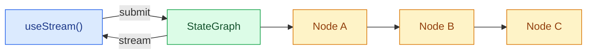

构建能够实时可视化 LangGraph Pipeline 的前端。这些模式展示了如何渲染多步骤 Graph Execution、每个节点的状态，以及来自自定义 `StateGraph` 工作流的流式内容。

LangGraph 在前端上的一个重要优势，是 UI 可以直接沿用图本身的结构。Node、State Key、Checkpoint、Interrupt、Subgraph 和流式 Message 都是运行时可见的一等概念，因此你可以构建能够解释“系统正在做什么”的界面，而不是把所有执行过程都隐藏在一条 Assistant Message 后面。

<Note>
这些模式使用 v1 版前端 SDK Package。如果你仍在使用更早版本，请参考 [React](https://github.com/langchain-ai/langgraphjs/blob/main/libs/sdk-react/docs/v1-migration.md)、[Vue](https://github.com/langchain-ai/langgraphjs/blob/main/libs/sdk-vue/docs/v1-migration.md)、[Svelte](https://github.com/langchain-ai/langgraphjs/blob/main/libs/sdk-svelte/docs/v1-migration.md) 和 [Angular](https://github.com/langchain-ai/langgraphjs/blob/main/libs/sdk-angular/docs/v1-migration.md) 的迁移指南。
</Note>

## 架构

LangGraph 的图由通过 Edge 连接起来的命名 Node 组成。每个 Node 执行一个步骤（例如分类、研究、分析、综合），并把结果写入某个特定的 State Key。在前端，SDK 的 Stream Handle 会以响应式方式暴露节点输出、流式 Token，以及运行时发现的 Subgraph，因此你可以很自然地把每个节点映射为一张 UI 卡片。



:::python

```python
from langgraph.graph import StateGraph, MessagesState, START, END

class State(MessagesState):
    classification: str
    research: str
    analysis: str
    synthesis: str

graph = StateGraph(State)
graph.add_node("classify", classify_node)
graph.add_node("do_research", research_node)
graph.add_node("analyze", analyze_node)
graph.add_node("synthesize", synthesize_node)
graph.add_edge(START, "classify")
graph.add_edge("classify", "do_research")
graph.add_edge("do_research", "analyze")
graph.add_edge("analyze", "synthesize")
graph.add_edge("synthesize", END)

app = graph.compile()
```

:::

:::js

```ts
import { Annotation, MessagesAnnotation, StateGraph, START, END } from "@langchain/langgraph";

const State = Annotation.Root({
  ...MessagesAnnotation.spec,
  classification: Annotation<string>(),
  research: Annotation<string>(),
  analysis: Annotation<string>(),
  synthesis: Annotation<string>(),
});

const graph = new StateGraph(State)
  .addNode("classify", classifyNode)
  .addNode("do_research", researchNode)
  .addNode("analyze", analyzeNode)
  .addNode("synthesize", synthesizeNode)
  .addEdge(START, "classify")
  .addEdge("classify", "do_research")
  .addEdge("do_research", "analyze")
  .addEdge("analyze", "synthesize")
  .addEdge("synthesize", END)
  .compile();
```

:::

在前端，@[`useStream`] 会通过 `stream.subgraphs` 暴露可用于发现 Graph Node 的 Subgraph 信息，并提供类似 `useMessages(stream, node)` 这样的 Selector Helper，用于读取某个特定 Node 的流式内容。当你需要最终的 `synthesis` 等完整 Graph State 字段时，仍然可以通过 `stream.values` 获取。Angular 通过 @[`injectStream`] 使用同样形态的 Stream API。

```ts
import { useStream } from "@langchain/react";

function Pipeline() {
  const stream = useStream<typeof graph>({
    apiUrl: "http://localhost:2024",
    assistantId: "pipeline",
  });

  const classification = stream.values?.classification;
  const research = stream.values?.research;
  const analysis = stream.values?.analysis;
  const graphNodes = [...stream.subgraphs.values()];
}
```

## 它与普通 Chat Stream 有什么不同

自定义 Graph 往往用于驱动真正的产品工作流，例如研究 Pipeline、审批流、数据 Pipeline、数据增强、代码审查、规划和多步骤分析。Frontend SDK 允许你直接使用图原生的运行时信号来渲染这些流程：

| 运行时概念 | 前端 UX |
| --- | --- |
| **命名 Node** | 为每个 Graph Node 展示一张卡片、时间线步骤或状态 Badge。 |
| **State Key** | 为分类、来源、分析、最终综合结果等类型化输出提供独立 UI 区域。 |
| **Streaming Metadata** | 把部分流式 Message 路由到真正生成它的 Node。 |
| **Checkpoint** | 为调试和审计检查历史 Graph State，或从历史状态恢复执行。 |
| **Interrupt** | 在某个 Node 暂停，等待人工输入、审批或修正，然后继续执行。 |
| **Subgraph** | 只在用户确实需要更多细节时，展开嵌套执行过程。 |

由于 SDK 直接暴露这些概念，你可以从一个简单 Chat Panel 逐步扩展到完整的 Workflow Debugger，而无需改变后端协议。

## 模式

<CardGroup cols={2}>
  <Card title="Graph Execution" icon="chart-dots" href="/oss/langgraph/frontend/graph-execution">
    可视化多步骤 Graph Pipeline，包括每个 Node 的状态和流式内容。
  </Card>
  <Card title="自定义 Stream Channel" icon="broadcast" href="/oss/langgraph/frontend/custom-stream-channels">
    把服务端自定义数据流式传到前端，并通过 `useExtension` 和 `useChannel` 读取。
  </Card>
</CardGroup>

## 相关模式

[LangChain 前端模式](/oss/langchain/frontend/overview)中的 Markdown Message、工具调用、人在回路、可恢复 Stream 和时间旅行，都可以与任意 LangGraph 图一起使用。无论后端使用 `createAgent`、`createDeepAgent` 还是自定义 `StateGraph`，Stream API 都提供相同的核心数据模型。
