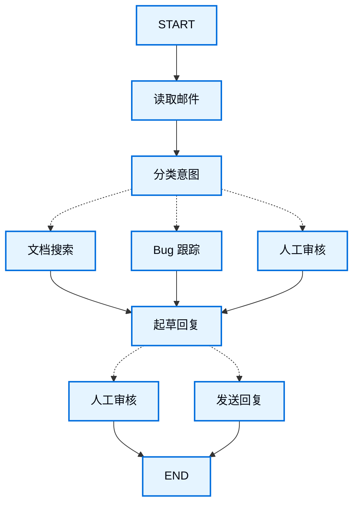

import LanggraphThinkingHitlV2Py from '/snippets/code-samples/langgraph-thinking-hitl-v2-py.mdx';

使用 LangGraph 构建智能体时，第一步通常是把整个流程拆成一系列离散步骤，也就是 **Node（节点）**。接下来，你需要描述每个 Node 可能做出的决策以及它可以发生的状态转移。最后，通过一个所有 Node 都可以读取和写入的共享 **State（状态）** 把这些 Node 连接起来。

本教程会通过一个“客服邮件智能体”的案例，带你完整走一遍使用 LangGraph 设计智能体时的思考过程。

## 从你真正想自动化的流程开始

假设你需要构建一个处理客服邮件的 AI Agent。产品团队给出了以下需求：

```txt
智能体应该能够：

- 读取收到的客户邮件
- 按紧急程度和主题对邮件分类
- 搜索相关文档以回答问题
- 起草合适的回复
- 将复杂问题升级给人工客服
- 必要时安排后续跟进

需要处理的示例场景：

1. 简单产品问题：“如何重置密码？”
2. Bug 报告：“选择 PDF 格式时导出功能会崩溃”
3. 紧急账单问题：“我的订阅被扣了两次钱！”
4. 功能请求：“可以给移动端 App 加暗色模式吗？”
5. 复杂技术问题：“我们的 API 集成会间歇性出现 504 错误”
```

在 LangGraph 中实现一个 Agent 时，通常会遵循下面五个步骤。

## 第 1 步：把工作流拆成离散步骤

先识别流程中彼此独立的步骤。每个步骤最终都会成为一个 **Node**（也就是只负责一件具体事情的函数）。然后画出这些步骤之间如何连接。



图中的箭头表示**可能的路径**，但真正决定下一步走哪条路径的逻辑发生在各个 Node 内部。

既然已经识别出了工作流中的主要组件，接下来看看每个 Node 分别需要做什么：

- `Read Email`：提取并解析邮件内容
- `Classify Intent`：使用 LLM 对紧急程度和主题分类，然后路由到合适的后续动作
- `Doc Search`：查询知识库中的相关信息
- `Bug Track`：在 Issue Tracking System 中创建或更新问题
- `Draft Reply`：生成合适的回复
- `Human Review`：升级给人工客服审批或处理
- `Send Reply`：发送邮件回复

<Tip>
注意，有些 Node 会决定下一步去哪里（例如 `Classify Intent`、`Draft Reply`、`Human Review`），而另一些 Node 总是进入同一个下一步（例如 `Read Email` 总是进入 `Classify Intent`，`Doc Search` 总是进入 `Draft Reply`）。
</Tip>

## 第 2 步：明确每一步到底需要做什么

对于图中的每个 Node，需要明确它属于哪一种操作，以及它正常工作需要哪些上下文。

<CardGroup cols={2}>
    <Card title="LLM 步骤" icon="brain" href="#llm-steps">
        当你需要理解、分析、生成文本或进行推理决策时使用
    </Card>
    <Card title="数据步骤" icon="database" href="#data-steps">
        当你需要从外部数据源获取信息时使用
    </Card>
    <Card title="动作步骤" icon="bolt" href="#action-steps">
        当你需要执行外部动作时使用
    </Card>
    <Card title="用户输入步骤" icon="user" href="#user-input-steps">
        当流程需要人工介入时使用
    </Card>
</CardGroup>

### LLM 步骤

当某个步骤需要理解、分析、生成文本或进行推理决策时：

<AccordionGroup>
    <Accordion title="意图分类">
        - 静态上下文（Prompt）：分类类别、紧急程度定义、输出格式
        - 动态上下文（来自 State）：邮件内容、发件人信息
        - 期望结果：能够决定后续路由的结构化分类结果
    </Accordion>

    <Accordion title="起草回复">
        - 静态上下文（Prompt）：语气规范、公司政策、回复模板
        - 动态上下文（来自 State）：分类结果、搜索结果、客户历史
        - 期望结果：一封可直接进入审核环节的专业邮件回复
    </Accordion>
</AccordionGroup>

### 数据步骤

当某个步骤需要从外部来源获取信息时：

<AccordionGroup>
    <Accordion title="文档搜索">
        - 参数：根据 Intent 与 Topic 构造 Query
        - 重试策略：需要；针对瞬时失败使用指数退避
        - 缓存：可以缓存常见 Query，减少 API 调用
    </Accordion>

    <Accordion title="客户历史查询">
        - 参数：来自 State 的客户邮箱或 ID
        - 重试策略：需要；如果服务不可用，可降级为基础信息
        - 缓存：需要；使用 TTL 在数据新鲜度和性能之间做平衡
    </Accordion>
</AccordionGroup>

### 动作步骤

当某个步骤需要执行外部动作时：

<AccordionGroup>
    <Accordion title="发送回复">
        - Node 何时执行：人工或自动审批通过后
        - 重试策略：需要；针对网络问题使用指数退避
        - 不应该缓存：每次发送都是一次独立动作
    </Accordion>

    <Accordion title="Bug 跟踪">
        - Node 何时执行：Intent 为 `bug` 时始终执行
        - 重试策略：需要；Bug 报告不能因为瞬时错误而丢失
        - 返回：需要写入回复中的 Ticket ID
    </Accordion>
</AccordionGroup>

### 用户输入步骤

当某个步骤需要人工介入时：

<AccordionGroup>
    <Accordion title="人工审核 Node">
        - 决策上下文：原始邮件、回复草稿、紧急程度、分类结果
        - 期望输入格式：审批 Boolean，以及可选的人工编辑后回复
        - 触发时机：高紧急度、复杂问题或质量存在疑虑时
    </Accordion>
</AccordionGroup>

## 第 3 步：设计 State

State 是智能体所有 Node 都可以访问的共享[记忆](/oss/concepts/memory)。可以把它理解为智能体在整个执行过程中用来记录“它学到了什么、做出了什么决定”的笔记本。

### 什么数据应该放进 State？

对于每一项数据，都可以问自己下面两个问题：

<CardGroup cols={2}>
    <Card title="应该放进 State" icon="check">
        这个数据是否需要跨多个步骤持续存在？如果需要，就应该进入 State。
    </Card>

    <Card title="不要存储" icon="code">
        这个数据能否根据其他数据重新推导？如果可以，就在需要时计算，而不是写入 State。
    </Card>
</CardGroup>

对于这个邮件 Agent，我们需要跟踪：

- 原始邮件和发件人信息（之后无法重新构造）
- 分类结果（后续多个 Node 都会使用）
- 搜索结果和客户数据（重新获取成本较高）
- 回复草稿（需要跨越人工审核环节持续存在）
- 执行元数据（用于调试和恢复）

### State 保留原始数据，需要时再格式化 Prompt

<Tip>
一个关键原则：**State 应该保存原始数据，而不是已经格式化好的文本。需要 Prompt 时，在 Node 内部即时格式化。**
</Tip>

把两者分开有几个好处：

- 不同 Node 可以按照自己的需要，用不同方式格式化同一份数据
- 可以修改 Prompt Template，而不需要修改 State Schema
- 调试更加清晰——你可以准确看到每个 Node 实际拿到了什么数据
- Agent 可以持续演进，而不会轻易破坏已有 State

下面定义我们的 State：

:::python

```python
from typing import TypedDict, Literal

# Define the structure for email classification
class EmailClassification(TypedDict):
    intent: Literal["question", "bug", "billing", "feature", "complex"]
    urgency: Literal["low", "medium", "high", "critical"]
    topic: str
    summary: str

class EmailAgentState(TypedDict):
    # Raw email data
    email_content: str
    sender_email: str
    email_id: str

    # Classification result
    classification: EmailClassification | None

    # Raw search/API results
    search_results: list[str] | None  # List of raw document chunks
    customer_history: dict | None  # Raw customer data from CRM

    # Generated content
    draft_response: str | None
    messages: list[str] | None
```

:::

:::js

```typescript
import { StateSchema } from "@langchain/langgraph";
import * as z from "zod";

// Define the structure for email classification
const EmailClassificationSchema = z.object({
  intent: z.enum(["question", "bug", "billing", "feature", "complex"]),
  urgency: z.enum(["low", "medium", "high", "critical"]),
  topic: z.string(),
  summary: z.string(),
});

const EmailAgentState = new StateSchema({
  // Raw email data
  emailContent: z.string(),
  senderEmail: z.string(),
  emailId: z.string(),

  // Classification result
  classification: EmailClassificationSchema.optional(),

  // Raw search/API results
  searchResults: z.array(z.string()).optional(),  // List of raw document chunks
  customerHistory: z.record(z.string(), z.any()).optional(),  // Raw customer data from CRM

  // Generated content
  responseText: z.string().optional(),
});

type EmailClassificationType = z.infer<typeof EmailClassificationSchema>;
```

:::

注意，这里的 State 只保存原始数据——没有 Prompt Template、没有格式化字符串，也没有行为指令。分类结果会直接按照 LLM 的结构化输出，以一个完整对象保存。

## 第 4 步：构建 Node

:::python

接下来把每一个步骤实现为函数。LangGraph 中的 Node 本质上就是一个 Python 函数：接收当前 State，并返回对 State 的更新。

:::

:::js

接下来把每一个步骤实现为函数。LangGraph 中的 Node 本质上就是一个 JavaScript 函数：接收当前 State，并返回对 State 的更新。

:::

### 正确处理不同类型的错误

不同错误应该使用不同的处理策略：

| 错误类型 | 谁负责修复 | 策略 | 适用场景 |
|------------|--------------|----------|-------------|
| 瞬时错误（网络问题、Rate Limit） | 系统（自动） | Retry Policy | 通常重试即可恢复的临时故障 |
| LLM 可恢复错误（Tool 失败、解析问题） | LLM | 把错误写入 State 并回到 Agent | LLM 能看到错误并调整下一次尝试 |
| 用户可修复错误（缺少信息、指令不清） | 人 | 使用 `interrupt()` 暂停 | 必须获得用户输入后才能继续 |
| 重试耗尽后的可恢复失败 | 开发者（声明式） | `error_handler` | 重试耗尽后执行补偿 / 恢复分支 |
| 未预期错误 | 开发者 | 让错误向上抛出 | 未知问题，需要调试 |

<Tabs>
    <Tab title="瞬时错误" icon="rotate">
        添加 Retry Policy，自动重试网络问题和 Rate Limit。

    :::python

    可以配合 `timeout=` 限制每次尝试的最长时间。完整生命周期参见[容错](/oss/langgraph/fault-tolerance)。

    ```python
    from langgraph.types import RetryPolicy

    workflow.add_node(
        "search_documentation",
        search_documentation,
        retry_policy=RetryPolicy(max_attempts=3, initial_interval=1.0)
    )
    ```

    :::

    :::js

    ```typescript
    import type { RetryPolicy } from "@langchain/langgraph";

    workflow.addNode(
      "searchDocumentation",
      searchDocumentation,
      {
        retryPolicy: { maxAttempts: 3, initialInterval: 1.0 },
      },
    );
    ```

    :::

    </Tab>

    <Tab title="LLM 可恢复错误" icon="brain">
        把错误保存进 State 并重新回到 Agent，这样 LLM 能看到失败原因并重新尝试：

    :::python

    ```python
    from langgraph.types import Command


    def execute_tool(state: State) -> Command[Literal["agent", "execute_tool"]]:
        try:
            result = run_tool(state['tool_call'])
            return Command(update={"tool_result": result}, goto="agent")
        except ToolError as e:
            # Let the LLM see what went wrong and try again
            return Command(
                update={"tool_result": f"Tool error: {str(e)}"},
                goto="agent"
            )
    ```

    :::

    :::js

    ```typescript
    import { Command, GraphNode } from "@langchain/langgraph";

    const executeTool: GraphNode<typeof State> = async (state, config) => {
      try {
        const result = await runTool(state.toolCall);
        return new Command({
          update: { toolResult: result },
          goto: "agent",
        });
      } catch (error) {
        // Let the LLM see what went wrong and try again
        return new Command({
          update: { toolResult: `Tool error: ${error}` },
          goto: "agent"
        });
      }
    }
    ```

    :::

    </Tab>

    <Tab title="用户可修复错误" icon="user">
        当流程需要补充信息时（例如 Account ID、Order Number 或澄清说明），暂停执行并向用户收集输入：

    :::python

    ```python
    from langgraph.types import Command


    def lookup_customer_history(
        state: State
    ) -> Command[Literal["lookup_customer_history", "draft_response"]]:
        if not state.get('customer_id'):
            user_input = interrupt({
                "message": "Customer ID needed",
                "request": "Please provide the customer's account ID to look up their subscription history"
            })
            return Command(
                update={"customer_id": user_input['customer_id']},
                goto="lookup_customer_history"
            )
        # Now proceed with the lookup
        customer_data = fetch_customer_history(state['customer_id'])
        return Command(update={"customer_history": customer_data}, goto="draft_response")
    ```

    :::

    :::js

    ```typescript
    import { Command, GraphNode, interrupt } from "@langchain/langgraph";

    const lookupCustomerHistory: GraphNode<typeof State> = async (state, config) => {
      if (!state.customerId) {
        const userInput = interrupt({
          message: "Customer ID needed",
          request: "Please provide the customer's account ID to look up their subscription history",
        });
        return new Command({
          update: { customerId: userInput.customerId },
          goto: "lookupCustomerHistory",
        });
      }
      // Now proceed with the lookup
      const customerData = await fetchCustomerHistory(state.customerId);
      return new Command({
        update: { customerHistory: customerData },
        goto: "draftResponse",
      });
    }
    ```

    :::

    </Tab>

    <Tab title="未预期错误" icon="alert-triangle">
        对于不知道该如何处理的错误，直接让它向上抛出，以便调试；不要捕获自己无法正确处理的异常：

    :::python

    ```python
    def send_reply(state: EmailAgentState):
        try:
            email_service.send(state["draft_response"])
        except Exception:
            raise  # Surface unexpected errors
    ```

    :::

    :::js

    ```typescript
    import { Command, GraphNode } from "@langchain/langgraph";

    const sendReply: GraphNode<typeof EmailAgentState> = async (state, config) => {
      try {
        await emailService.send(state.responseText);
      } catch (error) {
        throw error;  // Surface unexpected errors
      }
    }
    ```

    :::

    </Tab>

    <Tab title="Saga / 补偿" icon="arrows-exchange">
        当所有重试都耗尽后，运行一个 Recovery Function，更新 State 并路由到补偿分支。

    :::python

    完整模式参见[容错](/oss/langgraph/fault-tolerance#error-handling)。

    <Note>
    `error_handler` 需要 `langgraph>=1.2`。
    </Note>

    ```python
    from langgraph.errors import NodeError
    from langgraph.types import Command, RetryPolicy

    def payment_error_handler(state: State, error: NodeError) -> Command:
        return Command(
            update={"status": f"compensated: {error.error}"},
            goto="finalize",
        )

    workflow.add_node(
        "charge_payment",
        charge_payment,
        retry_policy=RetryPolicy(max_attempts=3, retry_on=ConnectionError),
        error_handler=payment_error_handler,
    )
    ```

    如果希望对图中所有 Node 统一应用同一组 `retry_policy`、`timeout` 或 `error_handler`，而不是在每次 `add_node` 时重复配置，可以使用 `StateGraph.set_node_defaults(...)`。单个 Node 上显式指定的值仍然具有更高优先级。参见[容错：Graph Defaults](/oss/langgraph/fault-tolerance#graph-defaults)。

    :::

    </Tab>
</Tabs>

### 实现邮件 Agent 的各个 Node

下面把每个 Node 实现为简单函数。始终记住：**Node 接收 State、执行工作、返回 State Update。**

<AccordionGroup>
    <Accordion title="读取与分类 Node" icon="brain">

    :::python

    ```python
    from typing import Literal
    from langgraph.graph import StateGraph, START, END
    from langgraph.types import interrupt, Command, RetryPolicy
    from langchain_openai import ChatOpenAI
    from langchain.messages import HumanMessage

    llm = ChatOpenAI(model="gpt-5-nano")

    def read_email(state: EmailAgentState) -> dict:
        """Extract and parse email content"""
        # In production, this would connect to your email service
        return {
            "messages": [HumanMessage(content=f"Processing email: {state['email_content']}")]
        }

    def classify_intent(state: EmailAgentState) -> Command[Literal["search_documentation", "human_review", "draft_response", "bug_tracking"]]:
        """Use LLM to classify email intent and urgency, then route accordingly"""

        # Create structured LLM that returns EmailClassification dict
        structured_llm = llm.with_structured_output(EmailClassification)

        # Format the prompt on-demand, not stored in state
        classification_prompt = f"""
        Analyze this customer email and classify it:

        Email: {state['email_content']}
        From: {state['sender_email']}

        Provide classification including intent, urgency, topic, and summary.
        """

        # Get structured response directly as dict
        classification = structured_llm.invoke(classification_prompt)

        # Determine next node based on classification
        if classification['intent'] == 'billing' or classification['urgency'] == 'critical':
            goto = "human_review"
        elif classification['intent'] in ['question', 'feature']:
            goto = "search_documentation"
        elif classification['intent'] == 'bug':
            goto = "bug_tracking"
        else:
            goto = "draft_response"

        # Store classification as a single dict in state
        return Command(
            update={"classification": classification},
            goto=goto
        )
    ```

    :::

    :::js

    ```typescript
    import { StateGraph, START, END, GraphNode, Command } from "@langchain/langgraph";
    import { HumanMessage } from "@langchain/core/messages";
    import { ChatAnthropic } from "@langchain/anthropic";

    const llm = new ChatAnthropic({ model: "claude-sonnet-4-6" });

    const readEmail: GraphNode<typeof EmailAgentState> = async (state, config) => {
      // Extract and parse email content
      // In production, this would connect to your email service
      console.log(`Processing email: ${state.emailContent}`);
      return {};
    }

    const classifyIntent: GraphNode<typeof EmailAgentState> = async (state, config) => {
      // Use LLM to classify email intent and urgency, then route accordingly

      // Create structured LLM that returns EmailClassification object
      const structuredLlm = llm.withStructuredOutput(EmailClassificationSchema);

      // Format the prompt on-demand, not stored in state
      const classificationPrompt = `
      Analyze this customer email and classify it:

      Email: ${state.emailContent}
      From: ${state.senderEmail}

      Provide classification including intent, urgency, topic, and summary.
      `;

      // Get structured response directly as object
      const classification = await structuredLlm.invoke(classificationPrompt);

      // Determine next node based on classification
      let nextNode: "searchDocumentation" | "humanReview" | "draftResponse" | "bugTracking";

      if (classification.intent === "billing" || classification.urgency === "critical") {
        nextNode = "humanReview";
      } else if (classification.intent === "question" || classification.intent === "feature") {
        nextNode = "searchDocumentation";
      } else if (classification.intent === "bug") {
        nextNode = "bugTracking";
      } else {
        nextNode = "draftResponse";
      }

      // Store classification as a single object in state
      return new Command({
        update: { classification },
        goto: nextNode,
      });
    }
    ```

    :::

    </Accordion>

    <Accordion title="搜索与跟踪 Node" icon="database">

    :::python

    ```python
    def search_documentation(state: EmailAgentState) -> Command[Literal["draft_response"]]:
        """Search knowledge base for relevant information"""

        # Build search query from classification
        classification = state.get('classification', {})
        query = f"{classification.get('intent', '')} {classification.get('topic', '')}"

        try:
            # Implement your search logic here
            # Store raw search results, not formatted text
            search_results = [
                "Reset password via Settings > Security > Change Password",
                "Password must be at least 12 characters",
                "Include uppercase, lowercase, numbers, and symbols"
            ]
        except SearchAPIError as e:
            # For recoverable search errors, store error and continue
            search_results = [f"Search temporarily unavailable: {str(e)}"]

        return Command(
            update={"search_results": search_results},  # Store raw results or error
            goto="draft_response"
        )

    def bug_tracking(state: EmailAgentState) -> Command[Literal["draft_response"]]:
        """Create or update bug tracking ticket"""

        # Create ticket in your bug tracking system
        ticket_id = "BUG-12345"  # Would be created via API

        return Command(
            update={
                "search_results": [f"Bug ticket {ticket_id} created"],
                "current_step": "bug_tracked"
            },
            goto="draft_response"
        )
    ```

    :::

    :::js

    ```typescript
    import { Command, GraphNode } from "@langchain/langgraph";

    const searchDocumentation: GraphNode<typeof EmailAgentState> = async (state, config) => {
      // Search knowledge base for relevant information

      // Build search query from classification
      const classification = state.classification!;
      const query = `${classification.intent} ${classification.topic}`;

      let searchResults: string[];

      try {
        // Implement your search logic here
        // Store raw search results, not formatted text
        searchResults = [
          "Reset password via Settings > Security > Change Password",
          "Password must be at least 12 characters",
          "Include uppercase, lowercase, numbers, and symbols",
        ];
      } catch (error) {
        // For recoverable search errors, store error and continue
        searchResults = [`Search temporarily unavailable: ${error}`];
      }

      return new Command({
        update: { searchResults },  // Store raw results or error
        goto: "draftResponse",
      });
    }

    const bugTracking: GraphNode<typeof EmailAgentState> = async (state, config) => {
      // Create or update bug tracking ticket

      // Create ticket in your bug tracking system
      const ticketId = "BUG-12345";  // Would be created via API

      return new Command({
        update: { searchResults: [`Bug ticket ${ticketId} created`] },
        goto: "draftResponse",
      });
    }
    ```
    :::
    </Accordion>

    <Accordion title="回复 Node" icon="edit">

    :::python

    ```python
    def draft_response(state: EmailAgentState) -> Command[Literal["human_review", "send_reply"]]:
        """Generate response using context and route based on quality"""

        classification = state.get('classification', {})

        # Format context from raw state data on-demand
        context_sections = []

        if state.get('search_results'):
            # Format search results for the prompt
            formatted_docs = "\n".join([f"- {doc}" for doc in state['search_results']])
            context_sections.append(f"Relevant documentation:\n{formatted_docs}")

        if state.get('customer_history'):
            # Format customer data for the prompt
            context_sections.append(f"Customer tier: {state['customer_history'].get('tier', 'standard')}")

        # Build the prompt with formatted context
        draft_prompt = f"""
        Draft a response to this customer email:
        {state['email_content']}

        Email intent: {classification.get('intent', 'unknown')}
        Urgency level: {classification.get('urgency', 'medium')}

        {chr(10).join(context_sections)}

        Guidelines:
        - Be professional and helpful
        - Address their specific concern
        - Use the provided documentation when relevant
        """

        response = llm.invoke(draft_prompt)

        # Determine if human review needed based on urgency and intent
        needs_review = (
            classification.get('urgency') in ['high', 'critical'] or
            classification.get('intent') == 'complex'
        )

        # Route to appropriate next node
        goto = "human_review" if needs_review else "send_reply"

        return Command(
            update={"draft_response": response.content},  # Store only the raw response
            goto=goto
        )

    def human_review(state: EmailAgentState) -> Command[Literal["send_reply", END]]:
        """Pause for human review using interrupt and route based on decision"""

        classification = state.get('classification', {})

        # interrupt() must come first - any code before it will re-run on resume
        human_decision = interrupt({
            "email_id": state.get('email_id',''),
            "original_email": state.get('email_content',''),
            "draft_response": state.get('draft_response',''),
            "urgency": classification.get('urgency'),
            "intent": classification.get('intent'),
            "action": "Please review and approve/edit this response"
        })

        # Now process the human's decision
        if human_decision.get("approved"):
            return Command(
                update={"draft_response": human_decision.get("edited_response", state.get('draft_response',''))},
                goto="send_reply"
            )
        else:
            # Rejection means human will handle directly
            return Command(update={}, goto=END)

    def send_reply(state: EmailAgentState) -> dict:
        """Send the email response"""
        # Integrate with email service
        print(f"Sending reply: {state['draft_response'][:100]}...")
        return {}
    ```

    :::

    :::js

    ```typescript
    import { Command, interrupt } from "@langchain/langgraph";

    const draftResponse: GraphNode<typeof EmailAgentState> = async (state, config) => {
      // Generate response using context and route based on quality

      const classification = state.classification!;

      // Format context from raw state data on-demand
      const contextSections: string[] = [];

      if (state.searchResults) {
        // Format search results for the prompt
        const formattedDocs = state.searchResults.map(doc => `- ${doc}`).join("\n");
        contextSections.push(`Relevant documentation:\n${formattedDocs}`);
      }

      if (state.customerHistory) {
        // Format customer data for the prompt
        contextSections.push(`Customer tier: ${state.customerHistory.tier ?? "standard"}`);
      }

      // Build the prompt with formatted context
      const draftPrompt = `
      Draft a response to this customer email:
      ${state.emailContent}

      Email intent: ${classification.intent}
      Urgency level: ${classification.urgency}

      ${contextSections.join("\n\n")}

      Guidelines:
      - Be professional and helpful
      - Address their specific concern
      - Use the provided documentation when relevant
      `;

      const response = await llm.invoke([new HumanMessage(draftPrompt)]);

      // Determine if human review needed based on urgency and intent
      const needsReview = (
        classification.urgency === "high" ||
        classification.urgency === "critical" ||
        classification.intent === "complex"
      );

      // Route to appropriate next node
      const nextNode = needsReview ? "humanReview" : "sendReply";

      return new Command({
        update: { responseText: response.content.toString() },  // Store only the raw response
        goto: nextNode,
      });
    }

    const humanReview: GraphNode<typeof EmailAgentState> = async (state, config) => {
      // Pause for human review using interrupt and route based on decision
      const classification = state.classification!;

      // interrupt() must come first - any code before it will re-run on resume
      const humanDecision = interrupt({
        emailId: state.emailId,
        originalEmail: state.emailContent,
        draftResponse: state.responseText,
        urgency: classification.urgency,
        intent: classification.intent,
        action: "Please review and approve/edit this response",
      });

      // Now process the human's decision
      if (humanDecision.approved) {
        return new Command({
          update: { responseText: humanDecision.editedResponse || state.responseText },
          goto: "sendReply",
        });
      } else {
        // Rejection means human will handle directly
        return new Command({ update: {}, goto: END });
      }
    }

    const sendReply: GraphNode<typeof EmailAgentState> = async (state, config) => {
      // Send the email response
      // Integrate with email service
      console.log(`Sending reply: ${state.responseText!.substring(0, 100)}...`);
      return {};
    }
    ```

    :::

    </Accordion>
</AccordionGroup>

## 第 5 步：把所有 Node 连接起来

现在把这些 Node 连接成真正可运行的 Graph。因为路由决策已经由 Node 自己处理，所以这里只需要添加少量必要 Edge。

要配合 `interrupt()` 使用[人在回路](/oss/langgraph/interrupts)，需要在编译时配置 [Checkpointer](/oss/langgraph/persistence)，这样不同 Run 之间的 State 才能被保存：

<Accordion title="Graph 编译代码" icon="sitemap" defaultOpen={true}>

:::python

```python
from langgraph.checkpoint.memory import MemorySaver
from langgraph.types import RetryPolicy

# Create the graph
workflow = StateGraph(EmailAgentState)

# Add nodes with appropriate error handling
workflow.add_node("read_email", read_email)
workflow.add_node("classify_intent", classify_intent)

# Add retry policy for nodes that might have transient failures
workflow.add_node(
    "search_documentation",
    search_documentation,
    retry_policy=RetryPolicy(max_attempts=3)
)
workflow.add_node("bug_tracking", bug_tracking)
workflow.add_node("draft_response", draft_response)
workflow.add_node("human_review", human_review)
workflow.add_node("send_reply", send_reply)

# Add only the essential edges
workflow.add_edge(START, "read_email")
workflow.add_edge("read_email", "classify_intent")
workflow.add_edge("send_reply", END)

# Compile with checkpointer for persistence, in case run graph with Local_Server --> Please compile without checkpointer
memory = MemorySaver()
app = workflow.compile(checkpointer=memory)
```

:::

:::js

```typescript
import { MemorySaver, RetryPolicy } from "@langchain/langgraph";

// Create the graph
const workflow = new StateGraph(EmailAgentState)
  // Add nodes with appropriate error handling
  .addNode("readEmail", readEmail)
  .addNode("classifyIntent", classifyIntent)
  // Add retry policy for nodes that might have transient failures
  .addNode(
    "searchDocumentation",
    searchDocumentation,
    { retryPolicy: { maxAttempts: 3 } },
  )
  .addNode("bugTracking", bugTracking)
  .addNode("draftResponse", draftResponse)
  .addNode("humanReview", humanReview)
  .addNode("sendReply", sendReply)
  // Add only the essential edges
  .addEdge(START, "readEmail")
  .addEdge("readEmail", "classifyIntent")
  .addEdge("sendReply", END);

// Compile with checkpointer for persistence
const memory = new MemorySaver();
const app = workflow.compile({ checkpointer: memory });
```
:::

</Accordion>

:::python
Graph Structure 很精简，是因为路由发生在 Node 内部返回的 @[`Command`] 对象中。每个 Node 可以通过 `Command[Literal["node1", "node2"]]` 这样的类型提示声明它可能前往哪些位置，使控制流保持显式且可追踪。
:::

:::js
Graph Structure 很精简，是因为路由发生在 Node 内部返回的 `Command` 对象中。每个 Node 会显式声明它可能前往哪些位置，因此整个 Flow 仍然清晰、可追踪。
:::

### 运行你的 Agent

下面使用一个需要人工审核的紧急 Billing Issue 来测试 Agent：

<Accordion title="测试 Agent" icon="flask">

:::python

<LanggraphThinkingHitlV2Py />

:::

:::js

```typescript
// Test with an urgent billing issue
const initialState: EmailAgentStateType = {
  emailContent: "I was charged twice for my subscription! This is urgent!",
  senderEmail: "customer@example.com",
  emailId: "email_123"
};

// Run with a thread_id for persistence
const config = { configurable: { thread_id: "customer_123" } };
const result = await app.invoke(initialState, config);
// The graph will pause at human_review
console.log(`Draft ready for review: ${result.responseText?.substring(0, 100)}...`);
```
```typescript
import { Command } from "@langchain/langgraph";

// When ready, provide human input to resume
const humanResponse = new Command({
  resume: {
    approved: true,
    editedResponse: "We sincerely apologize for the double charge. I've initiated an immediate refund...",
  }
});

// Resume execution
const finalResult = await app.invoke(humanResponse, config);
console.log("Email sent successfully!");
```

:::

</Accordion>

当执行到 `interrupt()` 时，Graph 会暂停，把所有内容保存进 Checkpointer，然后等待外部输入。即使几天以后，它也可以从准确的中断位置恢复。`thread_id` 会确保这次会话的全部 State 被归到同一个 Thread 中。

## 总结与下一步

### 核心认识

通过这个邮件 Agent，可以总结出 LangGraph 最重要的思维方式：

<CardGroup cols={2}>
    <Card title="拆成离散步骤" icon="sitemap" href="#step-1-map-out-your-workflow-as-discrete-steps">
        每个 Node 专注做好一件事。这样的拆分可以支持流式进度更新、能够暂停与恢复的持久化执行，并使调试更清晰，因为你可以检查每一步之间的 State。
    </Card>

    <Card title="State 是共享记忆" icon="database" href="#step-3-design-your-state">
        保存原始数据，而不是格式化后的文本。这样不同 Node 可以用不同方式复用同一份信息。
    </Card>

    <Card title="Node 就是函数" icon="code" href="#step-4-build-your-nodes">
        Node 接收 State、执行工作并返回更新。当它需要做路由决策时，同时指定 State Update 和下一跳目标。
    </Card>

    <Card title="错误也是控制流的一部分" icon="alert-triangle" href="#handle-errors-appropriately">
        瞬时失败交给 Retry；LLM 可恢复错误把上下文返回给 LLM；用户可修复问题暂停等待输入；未知错误则向上抛出用于调试。
    </Card>

    <Card title="人工输入是一等能力" icon="user" href="/oss/langgraph/interrupts">
        `interrupt()` 可以无限期暂停执行、保存全部 State，并在提供输入后从准确位置恢复。当它与 Node 中其他操作组合使用时，应当把它放在最前面。
    </Card>

    <Card title="Graph Structure 会自然形成" icon="sitemap" href="#step-5-wire-it-together">
        你只需要定义必要连接，Node 自己处理路由逻辑。这样控制流始终显式、可追踪——只要知道当前 Node，就能理解 Agent 下一步可能做什么。
    </Card>
</CardGroup>

### 进阶考虑：Node 粒度的权衡

<Accordion title="Node 粒度权衡" icon="adjustments">
<Info>
本节讨论 Node 粒度设计中的权衡。大多数应用可以跳过这一部分，直接采用上面展示的模式。
</Info>

你可能会问：为什么不把 `Read Email` 和 `Classify Intent` 合并成一个 Node？

又或者，为什么要把 Doc Search 与 Draft Reply 分开？

答案与**韧性（Resilience）**和**可观测性（Observability）**之间的权衡有关。

**韧性方面：** LangGraph 的[持久化层](/oss/langgraph/persistence)会在 Node 边界创建 Checkpoint。当工作流在中断或失败后恢复时，它会从停止执行的那个 Node 的开头重新开始。Node 越小，Checkpoint 越频繁；出现问题时需要重复执行的工作也就越少。如果把多个操作合并成一个大 Node，那么在 Node 末尾发生失败，就意味着必须从这个大 Node 的开头重新执行所有操作。

这个邮件 Agent 采用当前拆分方式，主要有以下原因：

- **隔离外部服务：** Doc Search 和 Bug Track 是独立 Node，因为它们都会调用外部 API。如果搜索服务很慢或失败，我们希望把这个故障与 LLM 调用隔离开，也可以只给这些特定 Node 配置 Retry Policy，而不影响其他 Node。

- **中间状态可见：** `Classify Intent` 独立成 Node 后，可以在真正采取动作之前检查 LLM 的判断。这对调试和监控很有价值——你可以清楚看到 Agent 在什么时候、为什么路由到 Human Review。

- **失败模式不同：** LLM Call、数据库查询和邮件发送需要不同的 Retry Strategy。拆成独立 Node 后，可以分别配置。

- **复用与测试：** 更小的 Node 更容易独立测试，也更容易在其他 Workflow 中复用。

另一种同样合理的方案，是把 `Read Email` 和 `Classify Intent` 合并成一个 Node。这样会失去“在分类前检查原始邮件”的能力，而且该 Node 中任意操作失败都会导致两部分一起重跑。对于大多数应用来说，把它们拆开后获得的可观测性和调试优势通常值得这点额外结构成本。

**应用层关注点：** 第 2 步里提到的缓存（例如是否缓存搜索结果）属于应用层决策，并不是 LangGraph Framework 自带的功能。你应该根据业务需求在 Node Function 内实现缓存；LangGraph 不会强制规定缓存策略。

**性能方面：** Node 更多并不等于执行更慢。LangGraph 默认会在后台写 Checkpoint（[async durability mode](/oss/langgraph/checkpointers#durability-modes)），因此 Graph 可以在不等待 Checkpoint 完成的情况下继续运行。这意味着可以用很小的性能成本获得更频繁的 Checkpoint。必要时可以调整行为：使用 `"exit"` 模式只在执行结束时写 Checkpoint，或者使用 `"sync"` 模式，在每次 Checkpoint 写入完成之前阻塞后续执行。
</Accordion>

### 接下来学什么

这篇教程介绍了如何用 LangGraph 的方式思考 Agent 架构。接下来可以继续学习：

<CardGroup cols={2}>
    <Card title="人在回路模式" icon="user-check" href="/oss/langgraph/interrupts">
        学习如何在 Tool 执行前增加审批、批量审批，以及其他 HITL 模式
    </Card>

    <Card title="Subgraph" icon="hierarchy" href="/oss/langgraph/use-subgraphs">
        为复杂的多步骤操作构建子图
    </Card>

    <Card title="Streaming" icon="broadcast" href="/oss/langgraph/streaming">
        增加流式输出，向用户实时展示执行进度
    </Card>

    <Card title="可观测性" icon="chart-line" href="/oss/langgraph/observability">
        使用 LangSmith 为调试和监控增加可观测性
    </Card>

    <Card title="工具集成" icon="tool" href="/oss/langchain/tools">
        集成 Web Search、数据库查询和 API Call 等更多工具
    </Card>

    <Card title="重试逻辑" icon="rotate" href="/oss/langgraph/use-graph-api#add-retry-policies">
        使用指数退避等策略为失败操作实现 Retry Logic
    </Card>
</CardGroup>