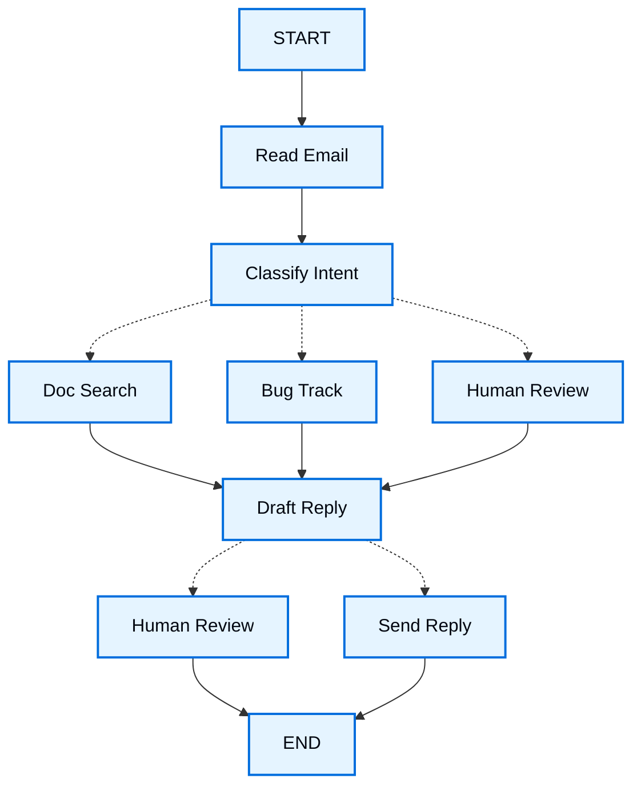

import LanggraphThinkingHitlV2Py from '/snippets/code-samples/langgraph-thinking-hitl-v2-py.mdx';

当你使用 LangGraph 构建 Agent 时，首先要把它拆分成若干离散步骤，这些步骤称为 **节点（nodes）**。接下来，你需要描述每个节点可能做出的不同决策以及节点之间的转换。最后，通过一个所有节点都可以读取和写入的共享 **状态（state）**，把这些节点连接起来。

在本教程中，我们会带你完整走一遍思考过程：如何使用 LangGraph 构建一个客户支持邮件 Agent。

## 从你想自动化的流程开始

假设你需要构建一个负责处理客户支持邮件的 AI Agent。产品团队给出了以下需求：

```txt
The agent should:

- Read incoming customer emails
- Classify them by urgency and topic
- Search relevant documentation to answer questions
- Draft appropriate responses
- Escalate complex issues to human agents
- Schedule follow-ups when needed

Example scenarios to handle:

1. Simple product question: "How do I reset my password?"
2. Bug report: "The export feature crashes when I select PDF format"
3. Urgent billing issue: "I was charged twice for my subscription!"
4. Feature request: "Can you add dark mode to the mobile app?"
5. Complex technical issue: "Our API integration fails intermittently with 504 errors"
```

在 LangGraph 中实现 Agent 时，通常会遵循下面五个步骤。

## 第 1 步：把工作流拆成离散步骤

首先识别流程中彼此独立的步骤。每个步骤都会成为一个 **节点**（即只负责一件具体事情的函数）。然后，画出这些步骤之间如何连接。



图中的箭头表示可能的执行路径，但实际应该走哪条路径，是在各个节点内部决定的。

既然已经识别出了工作流中的各个组成部分，下面看看每个节点具体需要做什么：

- `Read Email`：提取并解析邮件内容
- `Classify Intent`：使用 LLM 判断紧急程度和主题，然后路由到对应动作
- `Doc Search`：查询知识库中的相关信息
- `Bug Track`：在缺陷跟踪系统中创建或更新 Issue
- `Draft Reply`：生成合适的回复
- `Human Review`：升级给人工 Agent 进行审批或处理
- `Send Reply`：发送邮件回复

<Tip>
注意，有些节点会决定下一步去哪里（如 `Classify Intent`、`Draft Reply`、`Human Review`），而另一些节点总是进入同一个固定的下一步（例如 `Read Email` 总会进入 `Classify Intent`，`Doc Search` 总会进入 `Draft Reply`）。
</Tip>

## 第 2 步：明确每个步骤需要做什么

对于图中的每个节点，你需要确定它属于哪类操作，以及它正常工作所需的上下文。

<CardGroup cols={2}>
    <Card title="LLM 步骤" icon="brain" href="#llm-steps">
        当你需要理解、分析、生成文本或进行推理决策时使用
    </Card>
    <Card title="数据步骤" icon="database" href="#data-steps">
        当你需要从外部数据源检索信息时使用
    </Card>
    <Card title="动作步骤" icon="bolt" href="#action-steps">
        当你需要执行外部动作时使用
    </Card>
    <Card title="用户输入步骤" icon="user" href="#user-input-steps">
        当你需要人工介入时使用
    </Card>
</CardGroup>

### LLM 步骤

当某个步骤需要理解、分析、生成文本或进行推理决策时：

<AccordionGroup>
    <Accordion title="意图分类">
        - 静态上下文（Prompt）：分类类别、紧急程度定义、输出格式
        - 动态上下文（来自 State）：邮件内容、发件人信息
        - 期望结果：能够决定路由方向的结构化分类结果
    </Accordion>

    <Accordion title="起草回复">
        - 静态上下文（Prompt）：语气规范、公司政策、回复模板
        - 动态上下文（来自 State）：分类结果、搜索结果、客户历史
        - 期望结果：可供审核的专业邮件回复
    </Accordion>
</AccordionGroup>

### 数据步骤

当某个步骤需要从外部来源检索信息时：

<AccordionGroup>
    <Accordion title="文档搜索">
        - 参数：根据意图和主题构建的查询
        - 重试策略：需要；对于瞬时故障使用指数退避
        - 缓存：可以缓存常见查询，以减少 API 调用
    </Accordion>

    <Accordion title="客户历史查询">
        - 参数：来自 State 的客户邮箱或 ID
        - 重试策略：需要；如果不可用，则降级到基础信息
        - 缓存：需要；使用 TTL 在数据新鲜度与性能之间取得平衡
    </Accordion>
</AccordionGroup>

### 动作步骤

当某个步骤需要执行外部动作时：

<AccordionGroup>
    <Accordion title="发送回复">
        - 何时执行节点：人工或自动审批通过后
        - 重试策略：需要；网络问题使用指数退避
        - 不应缓存：每次发送都是一次唯一动作
    </Accordion>

    <Accordion title="缺陷跟踪">
        - 何时执行节点：意图为 `bug` 时始终执行
        - 重试策略：需要；不能丢失缺陷报告，因此很关键
        - 返回值：需要包含在回复中的 Ticket ID
    </Accordion>
</AccordionGroup>

### 用户输入步骤

当某个步骤需要人工介入时：

<AccordionGroup>
    <Accordion title="人工审核节点">
        - 决策上下文：原始邮件、回复草稿、紧急程度、分类结果
        - 期望输入格式：是否批准的布尔值，以及可选的编辑后回复
        - 触发条件：高紧急程度、复杂问题或质量风险
    </Accordion>
</AccordionGroup>

## 第 3 步：设计 State

State 是 Agent 中所有节点都可以访问的共享[记忆](/oss/concepts/memory)。你可以把它理解成 Agent 在处理任务过程中用来记录“已经知道什么、已经决定什么”的笔记本。

### 什么应该放进 State？

针对每一项数据，问自己下面两个问题：

<CardGroup cols={2}>
    <Card title="应该放进 State" icon="check">
        这项数据是否需要跨步骤持续存在？如果需要，就应该放进 State。
    </Card>

    <Card title="不要存储" icon="code">
        这项数据是否可以从其他数据推导出来？如果可以，就在需要时即时计算，而不是存进 State。
    </Card>
</CardGroup>

对于我们的邮件 Agent，需要追踪：

- 原始邮件和发件人信息（之后无法重新构造）
- 分类结果（多个下游节点都会使用）
- 搜索结果和客户数据（重新获取成本较高）
- 回复草稿（需要跨人工审核过程保留）
- 执行元数据（用于调试和恢复）

### State 保持原始数据，Prompt 按需格式化

<Tip>
    一个关键原则：State 应该保存原始数据，而不是已经格式化好的文本。只有在节点真正需要时，才在节点内部构造 Prompt。
</Tip>

这种分离意味着：

- 不同节点可以根据各自需要，以不同方式格式化同一份数据
- 你可以修改 Prompt 模板，而无需修改 State Schema
- 调试更清晰——你可以准确看到每个节点实际接收了什么数据
- Agent 可以持续演进，而不会破坏已有 State

下面定义 State：

:::python

```python
from typing import TypedDict, Literal

# Define the structure for email classification
class EmailClassification(TypedDict):
    intent: Literal["question", "bug", "billing", "feature", "complex"]
    urgency: Literal["low", "medium", "high", "critical"]
    topic: str
    summary: str

class EmailAgentState(TypedDict):
    # Raw email data
    email_content: str
    sender_email: str
    email_id: str

    # Classification result
    classification: EmailClassification | None

    # Raw search/API results
    search_results: list[str] | None  # List of raw document chunks
    customer_history: dict | None  # Raw customer data from CRM

    # Generated content
    draft_response: str | None
    messages: list[str] | None
```

:::

:::js

```typescript
import { StateSchema } from "@langchain/langgraph";
import * as z from "zod";

// Define the structure for email classification
const EmailClassificationSchema = z.object({
  intent: z.enum(["question", "bug", "billing", "feature", "complex"]),
  urgency: z.enum(["low", "medium", "high", "critical"]),
  topic: z.string(),
  summary: z.string(),
});

const EmailAgentState = new StateSchema({
  // Raw email data
  emailContent: z.string(),
  senderEmail: z.string(),
  emailId: z.string(),

  // Classification result
  classification: EmailClassificationSchema.optional(),

  // Raw search/API results
  searchResults: z.array(z.string()).optional(),  // List of raw document chunks
  customerHistory: z.record(z.string(), z.any()).optional(),  // Raw customer data from CRM

  // Generated content
  responseText: z.string().optional(),
});

type EmailClassificationType = z.infer<typeof EmailClassificationSchema>;
```

:::

注意，State 中只包含原始数据——没有 Prompt 模板、没有已经格式化好的字符串，也没有指令。分类输出会直接以一个字典/对象的形式保存，也就是 LLM 原始的结构化输出。

## 第 4 步：构建节点

:::python

现在我们把每个步骤实现为一个函数。在 LangGraph 中，一个 Node 本质上就是一个 Python 函数：它接收当前 State，并返回对 State 的更新。

:::

:::js

现在我们把每个步骤实现为一个函数。在 LangGraph 中，一个 Node 本质上就是一个 JavaScript 函数：它接收当前 State，并返回对 State 的更新。

:::

### 正确处理错误

不同类型的错误，需要采用不同的处理策略：

| 错误类型 | 谁来修复 | 策略 | 适用场景 |
|------------|--------------|----------|-------------|
| 瞬时错误（网络问题、限流） | 系统（自动） | Retry Policy | 通常重试后就能恢复的临时故障 |
| LLM 可恢复错误（工具失败、解析问题） | LLM | 将错误写入 State 并回到上一步 | LLM 能看到错误并调整策略 |
| 用户可修复错误（信息缺失、指令不清晰） | 人类 | 使用 `interrupt()` 暂停 | 需要用户输入后才能继续 |
| 重试耗尽后的可恢复失败 | 开发者（声明式） | `error_handler` | 重试全部失败后进入补偿/恢复分支 |
| 非预期错误 | 开发者 | 让异常向上抛出 | 需要调试的未知问题 |

<Tabs>
    <Tab title="瞬时错误" icon="rotate">
        添加 Retry Policy，以自动重试网络问题和限流错误。

    :::python

    可以结合 `timeout=` 限制每次尝试的最大耗时。完整生命周期请参阅[容错](/oss/langgraph/fault-tolerance)。

    ```python
    from langgraph.types import RetryPolicy

    workflow.add_node(
        "search_documentation",
        search_documentation,
        retry_policy=RetryPolicy(max_attempts=3, initial_interval=1.0)
    )
    ```

    :::

    :::js

    ```typescript
    import type { RetryPolicy } from "@langchain/langgraph";

    workflow.addNode(
      "searchDocumentation",
      searchDocumentation,
      {
        retryPolicy: { maxAttempts: 3, initialInterval: 1.0 },
      },
    );
    ```

    :::

    </Tab>

    <Tab title="LLM 可恢复错误" icon="brain">
        将错误保存到 State，然后循环回去，让 LLM 看到发生了什么并重新尝试：

    :::python

    ```python
    from langgraph.types import Command


    def execute_tool(state: State) -> Command[Literal["agent", "execute_tool"]]:
        try:
            result = run_tool(state['tool_call'])
            return Command(update={"tool_result": result}, goto="agent")
        except ToolError as e:
            # Let the LLM see what went wrong and try again
            return Command(
                update={"tool_result": f"Tool error: {str(e)}"},
                goto="agent"
            )
    ```

    :::

    :::js

    ```typescript
    import { Command, GraphNode } from "@langchain/langgraph";

    const executeTool: GraphNode<typeof State> = async (state, config) => {
      try {
        const result = await runTool(state.toolCall);
        return new Command({
          update: { toolResult: result },
          goto: "agent",
        });
      } catch (error) {
        // Let the LLM see what went wrong and try again
        return new Command({
          update: { toolResult: `Tool error: ${error}` },
          goto: "agent"
        });
      }
    }
    ```

    :::

    </Tab>

    <Tab title="用户可修复错误" icon="user">
        当需要额外信息时（例如账号 ID、订单号或澄清信息），暂停执行并从用户处收集输入：

    :::python

    ```python
    from langgraph.types import Command


    def lookup_customer_history(
        state: State
    ) -> Command[Literal["lookup_customer_history", "draft_response"]]:
        if not state.get('customer_id'):
            user_input = interrupt({
                "message": "Customer ID needed",
                "request": "Please provide the customer's account ID to look up their subscription history"
            })
            return Command(
                update={"customer_id": user_input['customer_id']},
                goto="lookup_customer_history"
            )
        # Now proceed with the lookup
        customer_data = fetch_customer_history(state['customer_id'])
        return Command(update={"customer_history": customer_data}, goto="draft_response")
    ```

    :::

    :::js

    ```typescript
    import { Command, GraphNode, interrupt } from "@langchain/langgraph";

    const lookupCustomerHistory: GraphNode<typeof State> = async (state, config) => {
      if (!state.customerId) {
        const userInput = interrupt({
          message: "Customer ID needed",
          request: "Please provide the customer's account ID to look up their subscription history",
        });
        return new Command({
          update: { customerId: userInput.customerId },
          goto: "lookupCustomerHistory",
        });
      }
      // Now proceed with the lookup
      const customerData = await fetchCustomerHistory(state.customerId);
      return new Command({
        update: { customerHistory: customerData },
        goto: "draftResponse",
      });
    }
    ```

    :::

    </Tab>

    <Tab title="非预期错误" icon="alert-triangle">
        让异常直接向上抛出，供调试使用。不要捕获你无法真正处理的异常：

    :::python

    ```python
    def send_reply(state: EmailAgentState):
        try:
            email_service.send(state["draft_response"])
        except Exception:
            raise  # Surface unexpected errors
    ```

    :::

    :::js

    ```typescript
    import { Command, GraphNode } from "@langchain/langgraph";

    const sendReply: GraphNode<typeof EmailAgentState> = async (state, config) => {
      try {
        await emailService.send(state.responseText);
      } catch (error) {
        throw error;  // Surface unexpected errors
      }
    }
    ```

    :::

    </Tab>

    <Tab title="Saga / 补偿" icon="arrows-exchange">
        当重试全部耗尽后，运行恢复函数，更新 State 并路由到补偿分支。

    :::python

    完整模式请参阅[容错](/oss/langgraph/fault-tolerance#error-handling)。

    <Note>
    `error_handler` 需要 `langgraph>=1.2`。
    </Note>

    ```python
    from langgraph.errors import NodeError
    from langgraph.types import Command, RetryPolicy

    def payment_error_handler(state: State, error: NodeError) -> Command:
        return Command(
            update={"status": f"compensated: {error.error}"},
            goto="finalize",
        )

    workflow.add_node(
        "charge_payment",
        charge_payment,
        retry_policy=RetryPolicy(max_attempts=3, retry_on=ConnectionError),
        error_handler=payment_error_handler,
    )
    ```

    如果希望为图中的所有节点统一应用相同的 `retry_policy`、`timeout` 或 `error_handler`，而不是在每次 `add_node` 时重复配置，可以使用 `StateGraph.set_node_defaults(...)`。单个节点上的配置仍然拥有更高优先级。参阅[容错](/oss/langgraph/fault-tolerance#graph-defaults)。

    :::

    </Tab>
</Tabs>

### 实现邮件 Agent 的各个节点

我们会把每个节点都实现为一个简单函数。记住：节点接收 State、完成工作，然后返回 State 更新。

<AccordionGroup>
    <Accordion title="读取与分类节点" icon="brain">

    :::python

    ```python
    from typing import Literal
    from langgraph.graph import StateGraph, START, END
    from langgraph.types import interrupt, Command, RetryPolicy
    from langchain_openai import ChatOpenAI
    from langchain.messages import HumanMessage

    llm = ChatOpenAI(model="gpt-5-nano")

    def read_email(state: EmailAgentState) -> dict:
        """Extract and parse email content"""
        # In production, this would connect to your email service
        return {
            "messages": [HumanMessage(content=f"Processing email: {state['email_content']}")]
        }

    def classify_intent(state: EmailAgentState) -> Command[Literal["search_documentation", "human_review", "draft_response", "bug_tracking"]]:
        """Use LLM to classify email intent and urgency, then route accordingly"""

        # Create structured LLM that returns EmailClassification dict
        structured_llm = llm.with_structured_output(EmailClassification)

        # Format the prompt on-demand, not stored in state
        classification_prompt = f"""
        Analyze this customer email and classify it:

        Email: {state['email_content']}
        From: {state['sender_email']}

        Provide classification including intent, urgency, topic, and summary.
        """

        # Get structured response directly as dict
        classification = structured_llm.invoke(classification_prompt)

        # Determine next node based on classification
        if classification['intent'] == 'billing' or classification['urgency'] == 'critical':
            goto = "human_review"
        elif classification['intent'] in ['question', 'feature']:
            goto = "search_documentation"
        elif classification['intent'] == 'bug':
            goto = "bug_tracking"
        else:
            goto = "draft_response"

        # Store classification as a single dict in state
        return Command(
            update={"classification": classification},
            goto=goto
        )
    ```

    :::

    :::js

    ```typescript
    import { StateGraph, START, END, GraphNode, Command } from "@langchain/langgraph";
    import { HumanMessage } from "@langchain/core/messages";
    import { ChatAnthropic } from "@langchain/anthropic";

    const llm = new ChatAnthropic({ model: "claude-sonnet-4-6" });

    const readEmail: GraphNode<typeof EmailAgentState> = async (state, config) => {
      // Extract and parse email content
      // In production, this would connect to your email service
      console.log(`Processing email: ${state.emailContent}`);
      return {};
    }

    const classifyIntent: GraphNode<typeof EmailAgentState> = async (state, config) => {
      // Use LLM to classify email intent and urgency, then route accordingly

      // Create structured LLM that returns EmailClassification object
      const structuredLlm = llm.withStructuredOutput(EmailClassificationSchema);

      // Format the prompt on-demand, not stored in state
      const classificationPrompt = `
      Analyze this customer email and classify it:

      Email: ${state.emailContent}
      From: ${state.senderEmail}

      Provide classification including intent, urgency, topic, and summary.
      `;

      // Get structured response directly as object
      const classification = await structuredLlm.invoke(classificationPrompt);

      // Determine next node based on classification
      let nextNode: "searchDocumentation" | "humanReview" | "draftResponse" | "bugTracking";

      if (classification.intent === "billing" || classification.urgency === "critical") {
        nextNode = "humanReview";
      } else if (classification.intent === "question" || classification.intent === "feature") {
        nextNode = "searchDocumentation";
      } else if (classification.intent === "bug") {
        nextNode = "bugTracking";
      } else {
        nextNode = "draftResponse";
      }

      // Store classification as a single object in state
      return new Command({
        update: { classification },
        goto: nextNode,
      });
    }
    ```

    :::

    </Accordion>

    <Accordion title="搜索与跟踪节点" icon="database">

    :::python

    ```python
    def search_documentation(state: EmailAgentState) -> Command[Literal["draft_response"]]:
        """Search knowledge base for relevant information"""

        # Build search query from classification
        classification = state.get('classification', {})
        query = f"{classification.get('intent', '')} {classification.get('topic', '')}"

        try:
            # Implement your search logic here
            # Store raw search results, not formatted text
            search_results = [
                "Reset password via Settings > Security > Change Password",
                "Password must be at least 12 characters",
                "Include uppercase, lowercase, numbers, and symbols"
            ]
        except SearchAPIError as e:
            # For recoverable search errors, store error and continue
            search_results = [f"Search temporarily unavailable: {str(e)}"]

        return Command(
            update={"search_results": search_results},  # Store raw results or error
            goto="draft_response"
        )

    def bug_tracking(state: EmailAgentState) -> Command[Literal["draft_response"]]:
        """Create or update bug tracking ticket"""

        # Create ticket in your bug tracking system
        ticket_id = "BUG-12345"  # Would be created via API

        return Command(
            update={
                "search_results": [f"Bug ticket {ticket_id} created"],
                "current_step": "bug_tracked"
            },
            goto="draft_response"
        )
    ```

    :::

    :::js

    ```typescript
    import { Command, GraphNode } from "@langchain/langgraph";

    const searchDocumentation: GraphNode<typeof EmailAgentState> = async (state, config) => {
      // Search knowledge base for relevant information

      // Build search query from classification
      const classification = state.classification!;
      const query = `${classification.intent} ${classification.topic}`;

      let searchResults: string[];

      try {
        // Implement your search logic here
        // Store raw search results, not formatted text
        searchResults = [
          "Reset password via Settings > Security > Change Password",
          "Password must be at least 12 characters",
          "Include uppercase, lowercase, numbers, and symbols",
        ];
      } catch (error) {
        // For recoverable search errors, store error and continue
        searchResults = [`Search temporarily unavailable: ${error}`];
      }

      return new Command({
        update: { searchResults },  // Store raw results or error
        goto: "draftResponse",
      });
    }

    const bugTracking: GraphNode<typeof EmailAgentState> = async (state, config) => {
      // Create or update bug tracking ticket

      // Create ticket in your bug tracking system
      const ticketId = "BUG-12345";  // Would be created via API

      return new Command({
        update: { searchResults: [`Bug ticket ${ticketId} created`] },
        goto: "draftResponse",
      });
    }
    ```
    :::
    </Accordion>

    <Accordion title="回复节点" icon="edit">

    :::python

    ```python
    def draft_response(state: EmailAgentState) -> Command[Literal["human_review", "send_reply"]]:
        """Generate response using context and route based on quality"""

        classification = state.get('classification', {})

        # Format context from raw state data on-demand
        context_sections = []

        if state.get('search_results'):
            # Format search results for the prompt
            formatted_docs = "\n".join([f"- {doc}" for doc in state['search_results']])
            context_sections.append(f"Relevant documentation:\n{formatted_docs}")

        if state.get('customer_history'):
            # Format customer data for the prompt
            context_sections.append(f"Customer tier: {state['customer_history'].get('tier', 'standard')}")

        # Build the prompt with formatted context
        draft_prompt = f"""
        Draft a response to this customer email:
        {state['email_content']}

        Email intent: {classification.get('intent', 'unknown')}
        Urgency level: {classification.get('urgency', 'medium')}

        {chr(10).join(context_sections)}

        Guidelines:
        - Be professional and helpful
        - Address their specific concern
        - Use the provided documentation when relevant
        """

        response = llm.invoke(draft_prompt)

        # Determine if human review needed based on urgency and intent
        needs_review = (
            classification.get('urgency') in ['high', 'critical'] or
            classification.get('intent') == 'complex'
        )

        # Route to appropriate next node
        goto = "human_review" if needs_review else "send_reply"

        return Command(
            update={"draft_response": response.content},  # Store only the raw response
            goto=goto
        )

    def human_review(state: EmailAgentState) -> Command[Literal["send_reply", END]]:
        """Pause for human review using interrupt and route based on decision"""

        classification = state.get('classification', {})

        # interrupt() must come first - any code before it will re-run on resume
        human_decision = interrupt({
            "email_id": state.get('email_id',''),
            "original_email": state.get('email_content',''),
            "draft_response": state.get('draft_response',''),
            "urgency": classification.get('urgency'),
            "intent": classification.get('intent'),
            "action": "Please review and approve/edit this response"
        })

        # Now process the human's decision
        if human_decision.get("approved"):
            return Command(
                update={"draft_response": human_decision.get("edited_response", state.get('draft_response',''))},
                goto="send_reply"
            )
        else:
            # Rejection means human will handle directly
            return Command(update={}, goto=END)

    def send_reply(state: EmailAgentState) -> dict:
        """Send the email response"""
        # Integrate with email service
        print(f"Sending reply: {state['draft_response'][:100]}...")
        return {}
    ```

    :::

    :::js

    ```typescript
    import { Command, interrupt } from "@langchain/langgraph";

    const draftResponse: GraphNode<typeof EmailAgentState> = async (state, config) => {
      // Generate response using context and route based on quality

      const classification = state.classification!;

      // Format context from raw state data on-demand
      const contextSections: string[] = [];

      if (state.searchResults) {
        // Format search results for the prompt
        const formattedDocs = state.searchResults.map(doc => `- ${doc}`).join("\n");
        contextSections.push(`Relevant documentation:\n${formattedDocs}`);
      }

      if (state.customerHistory) {
        // Format customer data for the prompt
        contextSections.push(`Customer tier: ${state.customerHistory.tier ?? "standard"}`);
      }

      // Build the prompt with formatted context
      const draftPrompt = `
      Draft a response to this customer email:
      ${state.emailContent}

      Email intent: ${classification.intent}
      Urgency level: ${classification.urgency}

      ${contextSections.join("\n\n")}

      Guidelines:
      - Be professional and helpful
      - Address their specific concern
      - Use the provided documentation when relevant
      `;

      const response = await llm.invoke([new HumanMessage(draftPrompt)]);

      // Determine if human review needed based on urgency and intent
      const needsReview = (
        classification.urgency === "high" ||
        classification.urgency === "critical" ||
        classification.intent === "complex"
      );

      // Route to appropriate next node
      const nextNode = needsReview ? "humanReview" : "sendReply";

      return new Command({
        update: { responseText: response.content.toString() },  // Store only the raw response
        goto: nextNode,
      });
    }

    const humanReview: GraphNode<typeof EmailAgentState> = async (state, config) => {
      // Pause for human review using interrupt and route based on decision
      const classification = state.classification!;

      // interrupt() must come first - any code before it will re-run on resume
      const humanDecision = interrupt({
        emailId: state.emailId,
        originalEmail: state.emailContent,
        draftResponse: state.responseText,
        urgency: classification.urgency,
        intent: classification.intent,
        action: "Please review and approve/edit this response",
      });

      // Now process the human's decision
      if (humanDecision.approved) {
        return new Command({
          update: { responseText: humanDecision.editedResponse || state.responseText },
          goto: "sendReply",
        });
      } else {
        // Rejection means human will handle directly
        return new Command({ update: {}, goto: END });
      }
    }

    const sendReply: GraphNode<typeof EmailAgentState> = async (state, config) => {
      // Send the email response
      // Integrate with email service
      console.log(`Sending reply: ${state.responseText!.substring(0, 100)}...`);
      return {};
    }
    ```

    :::

    </Accordion>
</AccordionGroup>

## 第 5 步：把节点连接起来

现在把这些节点连接成一个可以运行的图。由于节点会自行处理路由决策，我们只需要添加少量必要的 Edge。

为了通过 `interrupt()` 启用[人在回路](/oss/langgraph/interrupts)，需要在编译时配置 [Checkpointer](/oss/langgraph/persistence)，以便在多次运行之间保存 State：

<Accordion title="Graph 编译代码" icon="sitemap" defaultOpen={true}>

:::python

```python
from langgraph.checkpoint.memory import MemorySaver
from langgraph.types import RetryPolicy

# Create the graph
workflow = StateGraph(EmailAgentState)

# Add nodes with appropriate error handling
workflow.add_node("read_email", read_email)
workflow.add_node("classify_intent", classify_intent)

# Add retry policy for nodes that might have transient failures
workflow.add_node(
    "search_documentation",
    search_documentation,
    retry_policy=RetryPolicy(max_attempts=3)
)
workflow.add_node("bug_tracking", bug_tracking)
workflow.add_node("draft_response", draft_response)
workflow.add_node("human_review", human_review)
workflow.add_node("send_reply", send_reply)

# Add only the essential edges
workflow.add_edge(START, "read_email")
workflow.add_edge("read_email", "classify_intent")
workflow.add_edge("send_reply", END)

# Compile with checkpointer for persistence, in case run graph with Local_Server --> Please compile without checkpointer
memory = MemorySaver()
app = workflow.compile(checkpointer=memory)
```

:::

:::js

```typescript
import { MemorySaver, RetryPolicy } from "@langchain/langgraph";

// Create the graph
const workflow = new StateGraph(EmailAgentState)
  // Add nodes with appropriate error handling
  .addNode("readEmail", readEmail)
  .addNode("classifyIntent", classifyIntent)
  // Add retry policy for nodes that might have transient failures
  .addNode(
    "searchDocumentation",
    searchDocumentation,
    { retryPolicy: { maxAttempts: 3 } },
  )
  .addNode("bugTracking", bugTracking)
  .addNode("draftResponse", draftResponse)
  .addNode("humanReview", humanReview)
  .addNode("sendReply", sendReply)
  // Add only the essential edges
  .addEdge(START, "readEmail")
  .addEdge("readEmail", "classifyIntent")
  .addEdge("sendReply", END);

// Compile with checkpointer for persistence
const memory = new MemorySaver();
const app = workflow.compile({ checkpointer: memory });
```
:::

</Accordion>

:::python
图结构之所以可以保持得很精简，是因为路由发生在节点内部的 @[`Command`] 对象中。每个节点通过 `Command[Literal["node1", "node2"]]` 这样的类型提示声明自己可能前往哪些节点，因此执行流依然是显式且可追踪的。
:::

:::js
图结构之所以可以保持得很精简，是因为路由发生在节点内部的 `Command` 对象中。每个节点都会声明它可能前往哪些位置，因此执行流依然是显式且可追踪的。
:::

### 试运行你的 Agent

下面使用一个需要人工审核的紧急计费问题来运行 Agent：

<Accordion title="测试 Agent" icon="flask">

:::python

<LanggraphThinkingHitlV2Py />

:::

:::js

```typescript
// Test with an urgent billing issue
const initialState: EmailAgentStateType = {
  emailContent: "I was charged twice for my subscription! This is urgent!",
  senderEmail: "customer@example.com",
  emailId: "email_123"
};

// Run with a thread_id for persistence
const config = { configurable: { thread_id: "customer_123" } };
const result = await app.invoke(initialState, config);
// The graph will pause at human_review
console.log(`Draft ready for review: ${result.responseText?.substring(0, 100)}...`);
```
```typescript
import { Command } from "@langchain/langgraph";

// When ready, provide human input to resume
const humanResponse = new Command({
  resume: {
    approved: true,
    editedResponse: "We sincerely apologize for the double charge. I've initiated an immediate refund...",
  }
});

// Resume execution
const finalResult = await app.invoke(humanResponse, config);
console.log("Email sent successfully!");
```

:::

</Accordion>

当执行到 `interrupt()` 时，Graph 会暂停，将所有内容保存到 Checkpointer 中并进入等待状态。即使几天之后，也可以从完全相同的位置继续执行。`thread_id` 确保本次会话的所有 State 都会被归在一起保存。

## 总结与下一步

### 核心认识

通过构建这个邮件 Agent，我们可以总结出 LangGraph 的思维方式：

<CardGroup cols={2}>
    <Card title="拆分为离散步骤" icon="sitemap" href="#step-1-map-out-your-workflow-as-discrete-steps">
        每个 Node 只把一件事做好。这样的拆分让你可以流式展示进度，实现能够暂停和恢复的持久化执行，并通过检查各步骤之间的 State 更清楚地进行调试。
    </Card>

    <Card title="State 是共享记忆" icon="database" href="#step-3-design-your-state">
        保存原始数据，而不是格式化后的文本。这样不同节点可以用不同方式消费同一份信息。
    </Card>

    <Card title="Node 就是函数" icon="code" href="#step-4-build-your-nodes">
        Node 接收 State、完成工作并返回更新。当 Node 需要进行路由决策时，它会同时指定 State 更新和下一个目标位置。
    </Card>

    <Card title="错误也是执行流的一部分" icon="alert-triangle" href="#handle-errors-appropriately">
        瞬时故障通过重试处理；LLM 可恢复错误带着上下文重新循环；用户可修复的问题暂停等待输入；非预期错误则向上抛出以供调试。
    </Card>

    <Card title="人工输入是一等公民" icon="user" href="/oss/langgraph/interrupts">
        `interrupt()` 可以无限期暂停执行并保存全部 State；提供输入后，又能从原来的位置恢复。当它与同一节点中的其他操作组合使用时，应当首先调用。
    </Card>

    <Card title="Graph 结构会自然形成" icon="sitemap" href="#step-5-wire-it-together">
        你只需要定义必要的连接，路由逻辑由节点自己处理。这样控制流既显式又可追踪——只要观察当前节点，就能理解 Agent 下一步可能做什么。
    </Card>
</CardGroup>

### 进阶考虑

<Accordion title="Node 粒度的权衡" icon="adjustments">
<Info>
本节讨论 Node 粒度设计中的权衡。大多数应用可以跳过本节，直接使用上面的模式。
</Info>

你可能会问：为什么不把 `Read Email` 和 `Classify Intent` 合并成一个 Node？

或者，为什么要把 Doc Search 和 Draft Reply 分开？

答案在于**韧性（resilience）与可观测性之间的权衡**。

**韧性方面的考虑：** LangGraph 的[持久化层](/oss/langgraph/persistence)会在 Node 边界创建 Checkpoint。当工作流在中断或失败后恢复时，会从执行停止所在 Node 的开头重新开始。Node 越小，Checkpoint 越频繁，一旦出现问题，需要重复执行的工作就越少。反过来，如果你把多个操作合并进一个很大的 Node，那么即使失败发生在接近末尾的位置，也需要从该 Node 的开头重新执行所有操作。

为什么邮件 Agent 要这样拆分：

- **隔离外部服务：** Doc Search 和 Bug Track 分成独立 Node，因为它们会调用外部 API。如果搜索服务变慢或失败，我们希望把这类问题与 LLM 调用隔离开。这样可以只针对这些节点配置 Retry Policy，而不影响其他节点。

- **中间状态可见：** 把 `Classify Intent` 作为独立 Node，可以让我们在实际采取动作之前检查 LLM 做出的判断。这对调试和监控非常有价值——你可以清楚看到 Agent 在什么情况下、为什么路由到人工审核。

- **不同的失败模式：** LLM 调用、数据库查询和邮件发送需要不同的重试策略。拆成独立 Node 后，可以分别配置。

- **复用与测试：** 粒度更小的 Node 更容易单独测试，也更容易复用到其他工作流中。

另一种同样有效的方案：你也可以把 `Read Email` 和 `Classify Intent` 合并成一个 Node。代价是无法在分类前单独检查原始邮件，而且该 Node 中任何失败都会导致这两个操作一起重跑。对于大多数应用来说，拆分节点带来的可观测性和调试收益通常值得这点代价。

应用层面的考虑：第 2 步中关于缓存搜索结果的讨论属于应用层决策，而不是 LangGraph 框架本身提供的功能。你需要根据自己的具体需求，在 Node 函数内部实现缓存——LangGraph 不规定你应该如何缓存。

性能方面的考虑：Node 更多并不意味着执行更慢。LangGraph 默认会在后台写入 Checkpoint（[异步 durability 模式](/oss/langgraph/checkpointers#durability-modes)），因此 Graph 不需要等待 Checkpoint 完成就可以继续执行。这意味着你可以用很小的性能代价获得更频繁的 Checkpoint。如果有需要，也可以调整这一行为：使用 `"exit"` 模式只在执行结束时写入 Checkpoint，或使用 `"sync"` 模式让每次执行都等待 Checkpoint 写入完成。
</Accordion>

### 接下来可以学什么

以上内容介绍了如何用 LangGraph 的方式思考 Agent 构建。你可以在这个基础上继续扩展：

<CardGroup cols={2}>
    <Card title="人在回路模式" icon="user-check" href="/oss/langgraph/interrupts">
        学习如何在工具执行前加入人工审批、批量审批以及其他 HITL 模式
    </Card>

    <Card title="子图" icon="hierarchy" href="/oss/langgraph/use-subgraphs">
        为复杂的多步骤操作创建 Subgraph
    </Card>

    <Card title="流式输出" icon="broadcast" href="/oss/langgraph/streaming">
        添加 Streaming，向用户实时展示执行进度
    </Card>

    <Card title="可观测性" icon="chart-line" href="/oss/langgraph/observability">
        使用 LangSmith 添加可观测性，用于调试和监控
    </Card>

    <Card title="工具集成" icon="tool" href="/oss/langchain/tools">
        集成更多工具，用于 Web 搜索、数据库查询和 API 调用
    </Card>

    <Card title="重试逻辑" icon="rotate" href="/oss/langgraph/use-graph-api#add-retry-policies">
        为失败操作实现带指数退避的重试逻辑
    </Card>
</CardGroup>